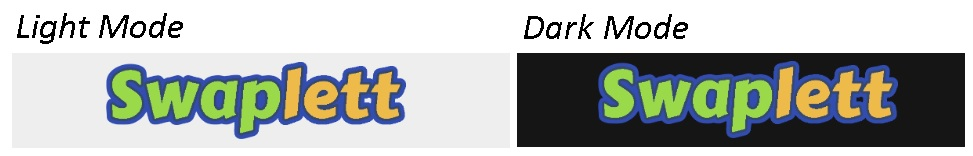
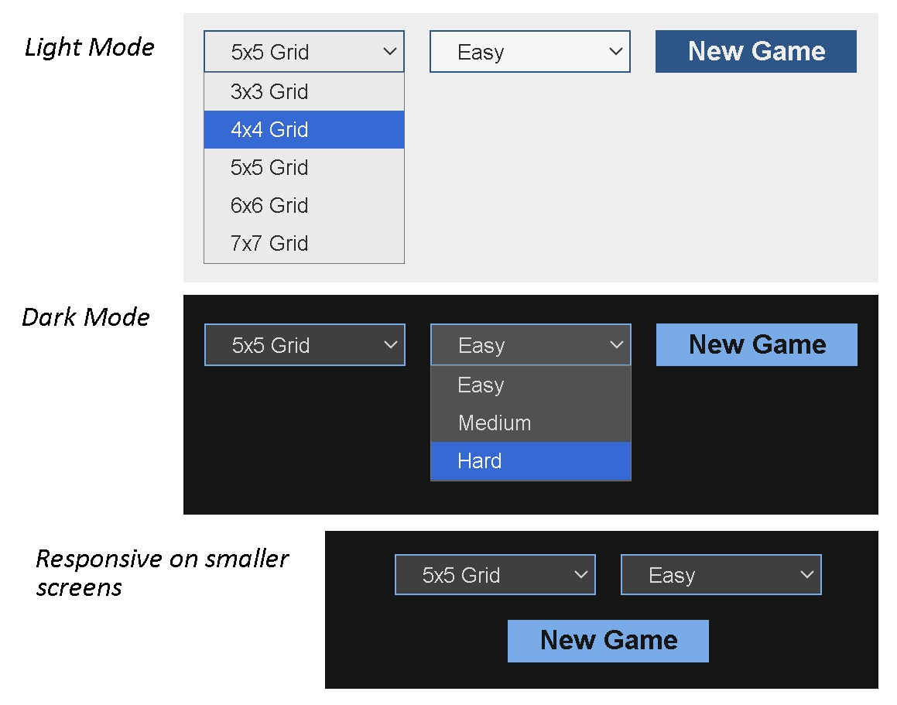
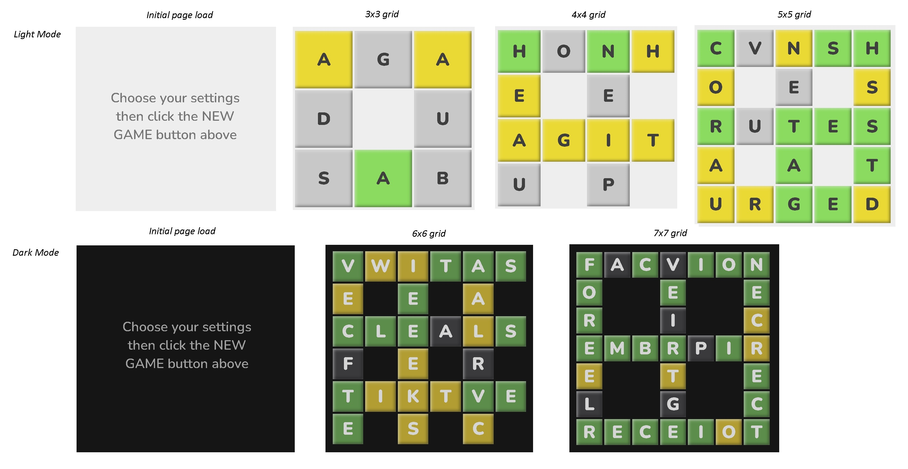
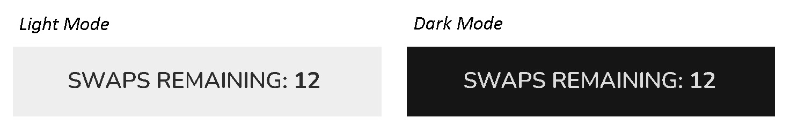
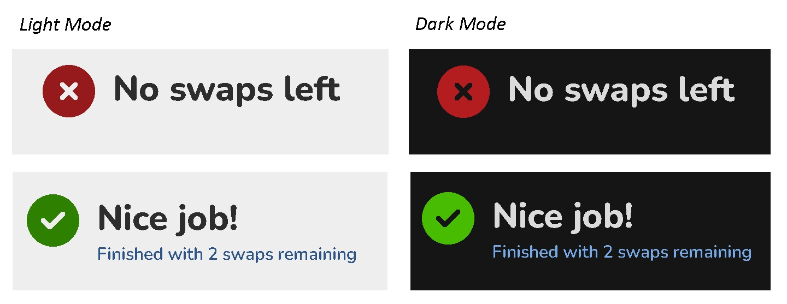
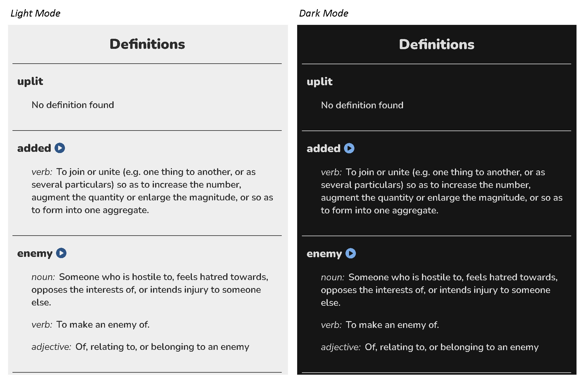
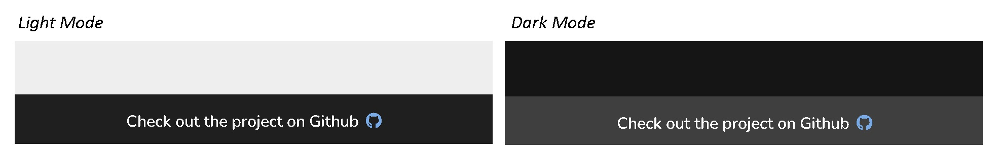
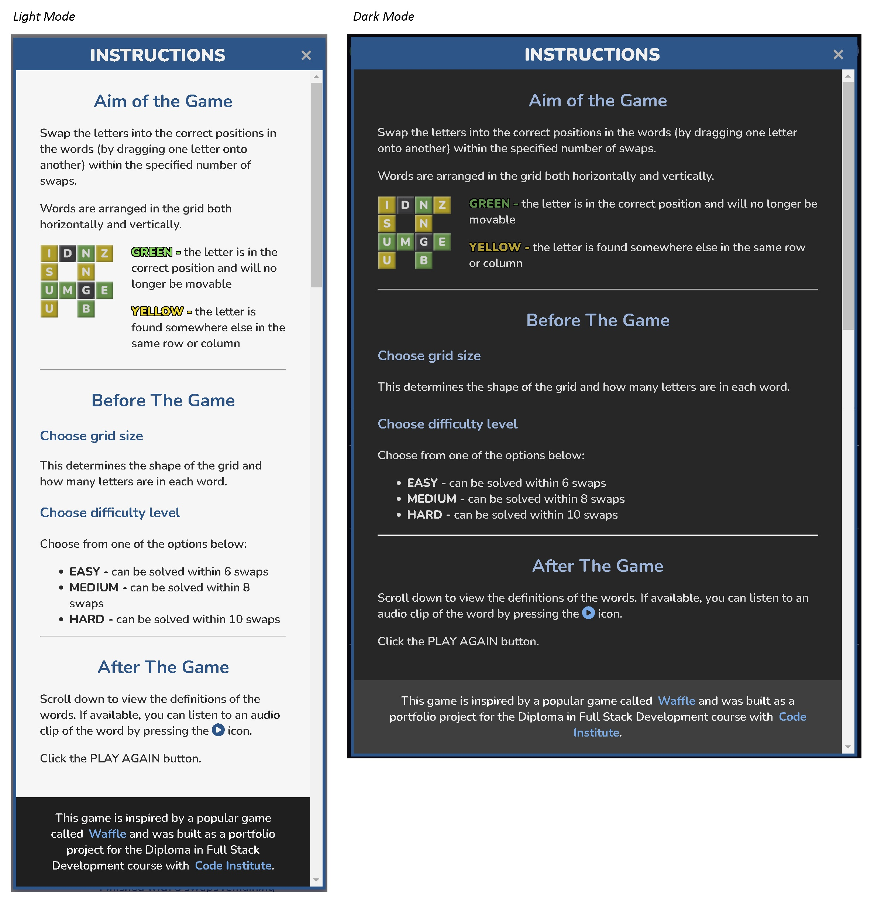

# Swaplett

Swaplett is a word puzzle game where players complete a grid of words by swapping letters into their correct positions. Letters can be moved by dragging them with a mouse or finger (on touch-screen devices). To win the game, players have to complete the grid within 15 swaps.

The project uses a third-party API (<a href="https://dictionaryapi.dev/" target="_blank" rel="noopener">**Free Dictionary API**</a>) to fetch information about words such as their meanings and links to pronounciation audio clips.

You can visit the deployed website <a href="https://lowrycode.github.io/swaplett-project/" target="_blank" rel="noopener">**here**</a>.
 


# Project Planning

The [**Project Planning**](project_planning.md) document outlines my personal goals for the project as well as the pseudo code for the JavaScript functionality.

# User Experience (UX) Design

## Responsive Design

The website was developed using a mobile-first approach, ensuring an optimized experience for mobile users before adapting to larger screens. This applies to functionality (e.g. touch events for dragging letters across the grid), layout (using `Flexbox`), and sizing (using relative units like `rem`, `%`, and `vh`). The custom `.container` class, combined with media queries, keeps content centered and prevents it from stretching too wide on larger screens.

Wireframes were produced using <a href="https://balsamiq.com/" target="_blank" rel="noopener">**Balsamiq**</a> at the earliest stages of planning to ensure an effective layout across different devices.


During development, the decision was made to give the header the same background colour as the main body as this was judged to create a more seamless and cohesive page design.

## User Interaction Design

The following features aim to ensure an enjoyable user experience when interacting with the site:

- **Intuitive Design** - icons use standard conventions (e.g. a toggle switch for dark-mode, a question mark icon for instructions), "X" button for closing modals (positioned in top right), placeholder instructions on game-board (shown on initial page load)
- **Text Legibility** - legible font (sans-serif), suitable text size and spacing, good colour contrast between text and background
- **Consistent Style** - similar elements look and behave in a similar way (e.g. colour themes for clickable buttons, hyperlinked text, select boxes, modals)
- **User Feedback** - hover effects (e.g. colour changes, tooltips, mouse cursor changes) to show interactive elements, in-game feedback (colour of grid cells, count of remaining swaps), end of game feedback (win / lose message displayed), elements in focus show outline (e.g. when using tab key to cycle through elements)
- **Transition Effects** - Smooth transitions for hover events and toggling dark mode colour theme

## Accessibility

The webpage is primarily designed for touch screen devices and so draggable elements can be moved using finger swipes. However, mouse drag-and-drop events are also supported for those accessing the website from a laptop / desktop computer.

The following features are included to assist screen readers:
- **Semantic HTML**
- **Form labels** - associated with inputs (though these are visibly hidden from the screen)
- **Alt text** - used to describe images
- **Aria-labels** - used for buttons, icons and checkboxes (e.g. buttons for playing audio clips or closing modals, checkbox  close modal buttons, dark-mode toggle switch)
- **Aria-labelledby** - used for identifying the relevant modal (instructions or alert)
- **Aria-checked** - used on toggle switch to indicate whether dark-mode is activated
- **Aria-hidden** - for elements that are only used for aesthetics (e.g. icons) or for hidden functionality (e.g. audio elements)

## Performance

Images have been optimized to ensure fast page loading. Since transparency was required, WebP formats could not be used so carefully scaled PNG files were used instead to maintain a balance between small file sizes and sufficient resolution.

The interactive elements on the page respond quickly, thanks to efficient JavaScript data structures and algorithms that prevent bottlenecks. Key optimizations include:
- **shuffleArray function:** Uses the *Fisher-Yates (Knuth)* Shuffle Algorithm (O(n) time complexity) to efficiently shuffle large arrays of words.
- **fetchDefinitionsArr function:** Leverages `Promise.all` to fetch word definitions in parallel, significantly reducing load time compared to sequential requests.
- **unresolvedGridCells variable:** Implemented as a `Set` instead of an `array` for faster item removal. While the performance gain is minor due to the small number of items, it ensures cleaner and more efficient lookups.

In the early stages of development, random words were fetched from the <a href="https://random-word-api.herokuapp.com/home" target="_blank" rel="noopener">Random Words API</a> instead of local JSON files. However, frequent downtime and the use of obscure words (many of which lacked definitions in the Free Dictionary API) led to a poor user experience. To address these issues, words were moved to local JSON files, which also eliminated the need for a blacklist of forbidden words.

# Current Features

## Header Section

### Toggle Switch For Dark Mode

Users can toggle between light mode and dark mode using the toggle switch in the top left corner. Light-mode is selected by default.


Hovering over the toggle switch causes the background colour to change slightly and a tooltip to appear. An `aria-label` and `aria-checked` attribute is used to assist screen readers.

When the switch is in focus, an outline is shown around the switch. This supports users who cycle to this element using the tab key.

Pressing the switch causes a smooth transition to the other colour theme. The colour of the switch changes to reflect the new theme and the position of the slider moves to the right (for dark mode) or left (for light mode). 

***NOTE:*** *An event listener is attached to this element in script.js. When dark mode is activated, the script adds the `.dark-mode` class to the document body element. This approach maintains separation of concerns by keeping styles in the CSS file (instead of modifying them directly with JavaScript inline styles). The `aria-label` is also updated to enhance accessibility for screen readers.*

### Swaplett Game Logo

The logo in the centre of the header is for improving the aesthetics of the page and is not interactive. The colour theme ensures a good colour contrast when using both light mode and dark mode. A png file format was chosen to allow for a transparent background.



### Icon To Open Instructions Modal

Clicking on the "btn-show-instructions" button in the top right of the screen reveals a modal with written instructions about how to play the game. The modal can be closed again by pressing the "X" button in the top right corner of the modal.


Hovering over both the "btn-show-instructions" and "X" buttons causes the background colour to change slightly and a tooltip to appear. An `aria-label` is used to assist screen readers.

When the buttons are in focus, an outline is shown around them to support users who cycle to this element using the tab key.

***NOTE:*** *The instructions modal is initially assigned a class called `.hidden` which removes it from the DOM and hides it from screen readers until the user chooses to open it. An event listener is attached to both the "btn-show-instructions" button and the "X" buttons in script.js to add / remove the `.hidden` class from this modal.*

## Game Settings Section

The Game Settings section appears directly underneath the header and remains visible throughout the game. It includes two `select` inputs and a `button`. All three elements have identical dimensions (width and height) and are dynamically positioned using `flexbox`.



The two `select` boxes have identical styles and behaviours (e.g. hover effects) and each have an associated `label` (included for semantic reasons as they benefit screen readers) although these are not visible on the screen.

The New Game `button` adopts the same style as the clickable elements in the header for consistency.

### Grid Size Select Input

This is used to choose the grid size and therefore the length of the words. It is set to 5x5 by default but can be set to one of the following: 3x3, 4x4, 5x5, 6x6 or 7x7.

### Difficulty Level Select Input

This is used to choose the difficulty level of the game and relates to the number of swaps that are required to complete the grid. Players must always complete the grid within 15 swaps to win the game.

***NOTE:*** *When the grid of words is initially generated, the completed grid is generated first and then it is jumbled up by making a specified number of random swaps to the position of letters. The difficulty level specifies the number of swaps that are made:*
*- EASY - 6 swaps*
*- MEDIUM - 8 swaps*
*- DIFFICULT - 10 swaps*

*It is possible that a swap may be undone by a subsequent swap and therefore in reality it is possible to complete the grid in fewer swaps than the numbers specified above.*

### New Game Button

Clicking this button starts a new game by:
1. **Resetting the visible elements on the page**
    - the count of remaining swaps is updated
    - the relevant DOM elements are shown / hidden
    - a placeholder text ("Generating board...") is added to the gameboard
2. **Building the grid of words**
    - an `array` of words of the correct length is fetched from the relevant JSON file in the **assets > json** directory and the `array` is then shuffled to randomise the order of these words
    - a smaller collection of these words are chosen if they together meet the criteria for the specified grid (i.e. their intersecting characters match)
    - the characters of each word are assigned to a 2D `array` (called `gridAnswerArr`) which stores their correct positions (i.e. row and column) in the grid
    - a copy of the `gridAnswerArr` (called `gridArr`) is jumbled by making a specified number of swaps (as determined by the difficulty level) - this becomes the initial state of the grid
    - the grid is drawn on the page (by dynamically writing HTML into the game-board section)
3. **Adding event handlers to the grid cells**
    - these relate to the drag-and-drop functionality

***NOTE:*** *if the random words cannot be fetched from the JSON file (e.g. no internet connection), an alert message is displayed to the user via the alert modal.*

## Game Board Section and Game Functionality

On initial page load, the game board section displays the message: *"Choose your settings, then click the NEW GAME button above"*. When the New Game button is clicked, this text briefly changes to *"Generating board..."* while the grid is being created. Once the grid is ready (usually almost instantly, but sometimes within a couple of seconds) it replaces the message.




The grid cells contain the letters from the words in the grid and have one of 3 background colours:
- **GREEN** -  this indicates that the letter is in the correct position. The grid cell will not be draggable and lacks any hover effects (indicating that users cannot interact with this grid cell). 
- **YELLOW** -  this indicates that the letter is found elsewhere in the same row and / or column. The grid cell is draggable and hover effects are used to indicate this (the mouse cursor shows a pointer).
- **GREY** -  this indicates that the letter is not found in the same row or column. The grid cell is draggable and hover effects are used to indicate this (the mouse cursor shows a pointer).

***NOTE:*** *the hover effects are managed by the `.draggable` class which is applied to all draggable grid cells and removed when a grid cell stops being draggable.*

When a user drags a draggable grid cell (by holding down a finger or mouse click whilst moving), the grid cell becomes semi-transparent and hovers over other elements. When it is dropped onto another grid cell, if both grid cells are draggable and do not contain the same letter, the following things will happen:
- letters will swap positions (both visually on the screen and by updating `gridArr`)
- the count of remaining swaps will decrement by 1
- the new positions of the letters are evaluated and background colours are updated if required
- if a letter is now in the correct position, the `.draggable` class is removed from that grid cell (to remove hover effects) and event listeners are also removed (to remove drag-and-drop behaviour)
- the state of the game is evaluated (to see if the game has ended)

If the game has ended (due to all grid cells being green or no more swaps remaining), the following actions occur:
- the count of remaining swaps is hidden
- the relevant win / lose message is displayed
- all drag-and-drop event listeners are removed from any remaining draggable elements (this only applies when the user loses the game)
- an API request fetches the definitions of the words (or an alert box is shown if the request fails)
- the definitions are displayed on the screen

***NOTE:*** *if the word is not found in the dictionary API, a 404 error is returned. The script handles this error by printing "No definition found".*

## Remaining Swaps Section

This section shows the count of how many swaps are remaining. Every game allows the user a maximum of 15 swaps to complete the grid. The count is updated (decreased by 1) after every swap.



***NOTE:*** *if a swap is not valid (e.g. when a user attempts to swap two grid cells which contain the same letter), the count of remaining swaps is not decremented for that attempt.*

This section is only visible during game play - it is hidden on initial page load and at the end of each game.

***NOTE:*** *This section is initially assigned a class called `.hidden` which removes it from the DOM and hides it from screen readers until the game starts. When the game starts, the `.hidden` class is removed.*


## Game End Section

This section shows the relevant win or lose message at the end of the game.



This section is only visible at the end of the game - it is hidden on initial page load and during game play.

***NOTE:*** *This section is initially assigned a class called `.hidden` (along with the child sections for win and lose messages) which removes them from the DOM and hides them from screen readers until the game ends. When the game ends, the `.hidden` class is removed from this section and the relevant child section (win or lose section) causing the message to be shown. The `.hidden` class is reassigned when a new game begins.*

If the user only had 1 swap remaining, the win message displays the correct grammar by writing **swap** (singular) rather than **swaps** (plural).

## Definitions Section

This section shows the definitions of any words that were used in the grid. The HTML for this section is generated dynamically.



Since these definitions are fetched from a third-party API, sometimes these definitions cannot be found - if so, a "No definition found" message will be displayed.

Sometimes links to audio clips (of word pronounciations) are included - if so, a circle-play button appears next to the word which includes hover effects (to show that it is clickable). The audio clip will play when the user clicks the button.

This section is only visible at the end of the game - it is hidden on initial page load and during game play.

***NOTE:*** *This section is initially assigned a class called `.hidden` which removes it from the DOM and hides it from screen readers until the game ends. When the game ends, the `.hidden` class is removed from this section causing the definitions to be shown. The `.hidden` class is reassigned when a new game begins to hide it again.*

## Footer

The footer sits at the bottom of the page and includes a link to the GitHub repository. The GitHub icon matches the styling of other hyperlinks and shares the same hover effects so that users recognise it as a clickable element.



## Instructions Modal

As discussed [previously](#icon-to-open-instructions-modal), the instructions modal can be opened by clicking on the `btn-show-instructions` button (the circle-question-mark icon) in the top right corner of the page.

The modal consists of:
- a dark semi-transparent overlay (to darken the main page content)
- the main dialogue box (which sits above the overlay)

On smaller screens, the dialogue box takes nearly the full width of the screen but on larger screens it is centred with a maximum width of 700px.



### Modal Header

The header of the dialogue box includes the modal title ("Instructions") and the "X" close button with appropriate hover effects (colour change and tool tip). It remains fixed at the top of the modal.

### Modal Body

This includes the instructions for the game and is split into sections which are separated by horizontal lines. A vertical scroll bar allows users to navigate easily through the content.

### Modal Footer

The modal "footer" section is not a footer in the true sense but rather the last section within the modal body - it is included within the flow of the scrollable body section.

It shows some additional information about the project including:
- a hyperlink to the game that inspired it
- a hyperlink to the Code Institute website (since this project was developed as part of the Level 5 Diploma course)

All hyperlinks on the webpage are styled consistently using the same colour and hover effects.

## Alert Modal

This modal is designed for showing significant notifications to the user and is dynamic by nature (allowing the title and message to be set at runtime). It is currently used for showing when an error occurs (e.g. when an API request fails).


The styling is very similar to the instructions modal but these modals have a smaller maximum width of 480px.

# Possible Future Features

Here are some possible features which would further enhance the user experience:
1. Use `localStorage` to:
    - flag whether a user is a first-time visitor (so can prompt them to read the instructions and learn about the game)
    - save user preferences about colour theme (so can automatically turn dark-mode on for users who prefer this theme) 
2. Add animations at the end of the game to reward users who complete the grid successfully
    - these would be subtle and short (to prevent users becoming irritated by them)
    - perhaps the animations would involve cycling through the grid cells and enlarging them
3. Improve the design of the end of game messages
    - perhaps replace the text with an image and include a zoom animation
4. Restore scroll and swipe behaviours on grid cells at the end of the game
    - currently all default events have been removed from grid cells to allow for better control of the drag and drop behaviours during game play
5. Expand the word banks
    - this would allow for greater variation between games but could potentially have a negative effect on the time taken to generate the grid of words
6. Check all words in the word banks are included as entries in the dictionary API
    -  this would ensure that the "No definition found" message is not displayed to the user
7. Use more obscure words when the difficulty level is set to "Hard"
    - this would require addtional JSON files for storing these words
    - it is more likely that these words would not be found when using the dictionary API

# JavaScript Code

Since the aim of this project was to build an interactive website using JavaScript, this section gives special consideration to the JavaScript code itself. In the [**Project Planning**](project_planning.md) document I summarised my goals in demonstrating best coding practices with regards to *readability*, *maintainability* and *logic* so we will structure the discussion using these categories.

## Readability

The code follows standard JavaScript conventions. For example:
- **Variables and Functions:** have **meaningful names** and are written in **camelCase** (e.g. newGame(), wordLength)
- **Constants:** written in UPPER_CASE (e.g. `MIN_WORD_LENGTH`, `MAX_WORD_LENGTH`)
- **Code Indentation:** for easily reading code blocks (4 spaces used consistently)
- **Semicolons:** used consistently (as verified by JSHint)
- **Template Literals:** using back-ticks with `${placeholder}` instead of string concatenations
- **Comments:** used to organise and explain code
- **JSDocs:** used to document all main functions and helper functions

These features ensure that the code is easily understood by other Javascript developers and allows for better collaboration.

## Maintainability

### Separation of Concerns

The way the project is structured ensures that there is a good separation of concerns:
- The main HTML file (**index.html**) deals with the content and structure of the page.
- All css styling rules are written in an external stylesheet (**style.css**) rather than embedded within style tags within the header of the HTML file.
- All JavaScript functionality is written in an external js file (**script.js**) rather than embedded within script tags within the body of the HTML file.

Event listeners are defined within the JavaScript file (rather than with inline event attributes like `onclick`).

When JavaScript is used to modify the styling and visibility of elements, it typically does so by adding or removing classes. This approach ensures that styling rules remain exclusively in the stylesheet, maintaining a clean separation between behaviour and presentation. However, when creating the grid cells in the `createGridCell` function, JavaScript is allowed to specify the heights and widths of these elements. This is necessary because the grid dimensions depend on the size chosen by the user, and these values must be calculated dynamically rather than predefined in the stylesheet.

### Code Reusability

There is also a logical separation of functionalities with each function focusing on a single task. This is known as the **Single Responsibility Principle** and ensures that the code is modular and reusable (following the *DRY principle*).

For example, the `makeSwap` function is called whenever a user makes a valid swap on the grid. This function involves carrying out a number of procedures but rather than incorporating all of them directly within this function, each procedure is abstracted into its own helper function:
- **`updateGridArr`:** This function updates the array which stores the letters at each location in the grid.
- **`updateGridCellContents`:** This function updates the page display to show the new positions of letters within the grid.
- **`setGridCellClassNames`:** This function ensures that each grid cell has the relevant classes assigned (.draggable, .green, .yellow) as dictated by the position of the letter in the grid. *This function is called for both the dragged cell and the target cell and is also used by the `drawGrid` function when initially setting up a new game.*
- **`processResolvedGridCells`:** This function checks if a grid cell is resolved (i.e. the letter is in the correct position) and, if so, removes drag events from the cell and removes its coordinates from the `unresolvedGridCells` set. *This function is called for both the dragged cell and the target cell separately.*
- **`endGame`:** This function is conditionally called if the game has ended and handles multiple procedures that are called at the end of the game.

Structuring the code in this way ensures that it is easy to understand, modify and test.

### Code Extensibility

The code was also written with extensibility in mind. For example, the HTML structure of the modals is consistent and uses the same class names. This means that the same styling rules can be applied to existing modals and any others added in the future. It also has the benefit that JavaScript can target all of the modal close buttons and apply the same event listener to all of them, even ones added in the future.

```js
const closeButtons = document.getElementsByClassName("btn-close-modal");
for (let btn of closeButtons) {
    btn.addEventListener("click", (e) => {
        let modalElement = e.target.closest(".modal-overlay");
        modalElement.classList.add("hidden");
    });
}
```

This approach ensures that there is minimal disruption to the code when new features are added.

### Minimising Bugs

To make the code more robust and easier to debug, a number of best practices were adopted.

**1. Variables defined in block scope**

Older Javascript code used the `var` keyword when defining variables. This approach to defining variables is more error prone because the variable is function scoped and accessible throughout the whole function in which it is declared. The variable could be accidentally re-declared and modified later in the function. Global variables were also avoided for similar reasons.

This project used the more robust and modern approach which is to define variables in block scope using the `let` and `const` key words. This prevents bugs caused by accidentally re-declaring variables later in the code. Using `const` for variables that should remain unchanged within the block also helps to catch bugs caused when changing the values of these variables.

***NOTE:*** *variables which are not defined using one of the three declaration words above become global variables by default. Therefore, the code was checked using the JSHint website to ensure that all variables were exlicitly defined.*

**2. Strict Equality and Type Coercion**

When doing logical comparisons, strict equality (`===` or `!==`) was used in preference to loose equality (`==` and `!=`) since loose equality allows implicit type coercion and is harder to debug. 

When type conversion is required, a better approach is to handle the type conversion manually to ensure clarity and avoid unexpected behaviour. This was required in the following cases:
- converting data from form inputs (from text to numbers)
```js
const wordLength = parseInt(document.getElementById("grid-select").value);
```
- converting data from element attributes (e.g. when getting the row number of a grid cell)
```js
let r1 = parseInt(draggedElement.getAttribute("data-row"));
```

**3. Avoiding Deep Nesting**

Code that involves deeply nested logic is difficult to read and debug so this was avoided using logical operators to check multiple conditions at the top level.

For example, in the jumbleGridArr function, multiple `&&` operators are used to check criteria within a while loop as follows:

```js
// Check swap is valid
if (jumbledGridArr[r1][c1] !== null &&
    jumbledGridArr[r2][c2] !== null &&
    jumbledGridArr[r1][c1] !== jumbledGridArr[r2][c2] &&
    jumbledGridArr[r1][c1] !== gridArr[r2][c2] &&
    jumbledGridArr[r2][c2] !== gridArr[r1][c1]
) {
    // Make the swap
    ...
}
```

For asynchronous operations, using promises with `.then` can sometimes lead to deeply nested `.then` chains. This was avoided by using `async/await` instead.

**4. Error Handling**

When errors occur in helper functions, they are thrown to the caller function and handled at a higher level. This approach ensures that error messages displayed to the end user are managed efficiently, reducing code repetition and maintaining a clear separation between error detection and user-facing error handling.

