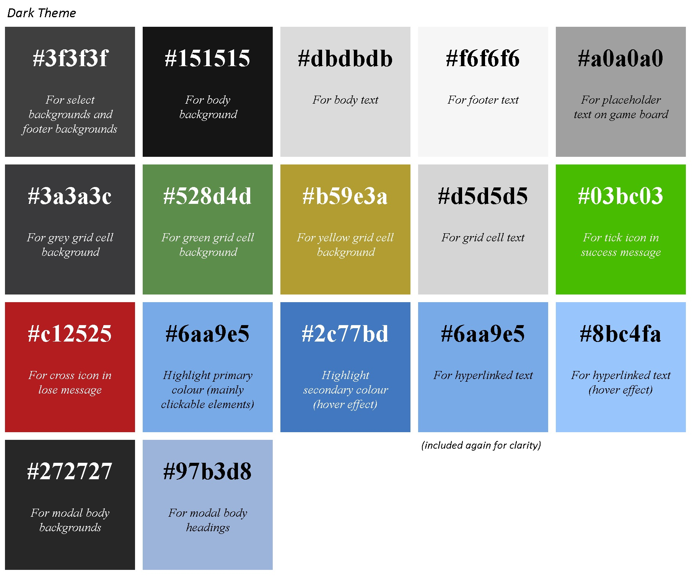
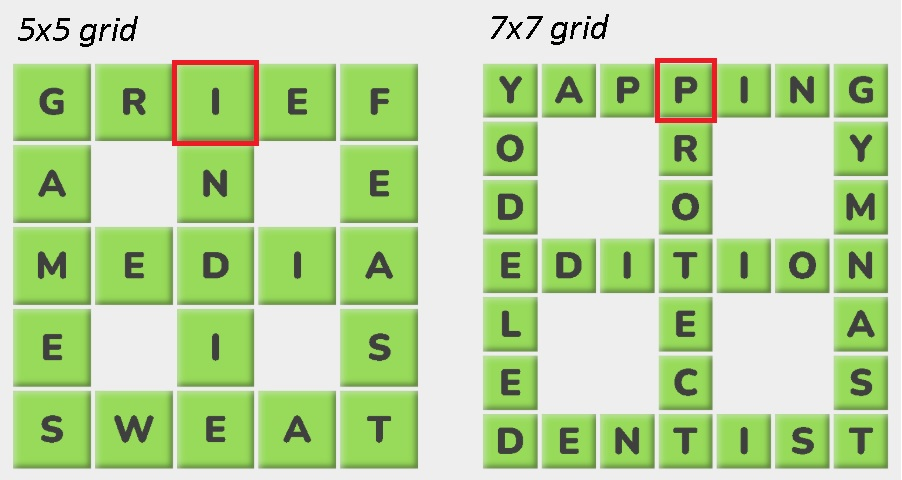
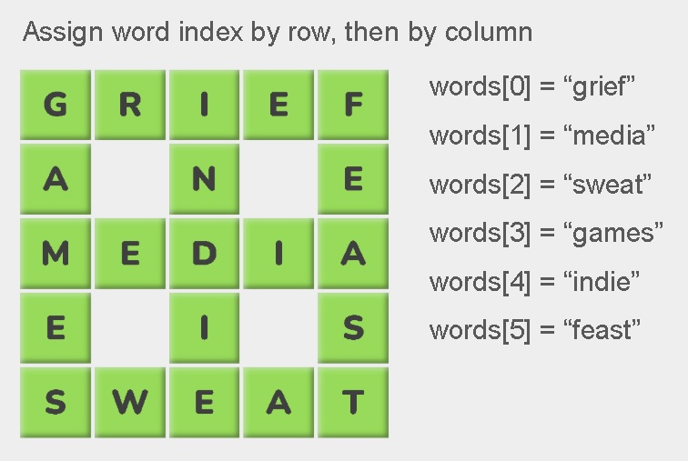
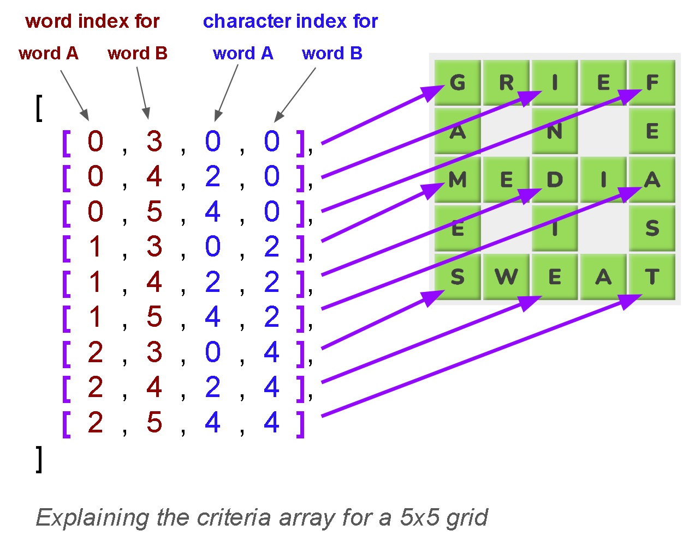
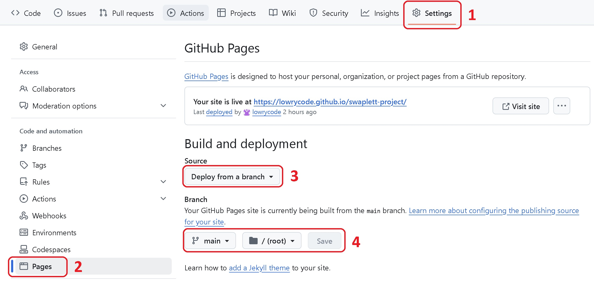
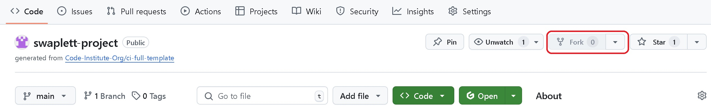
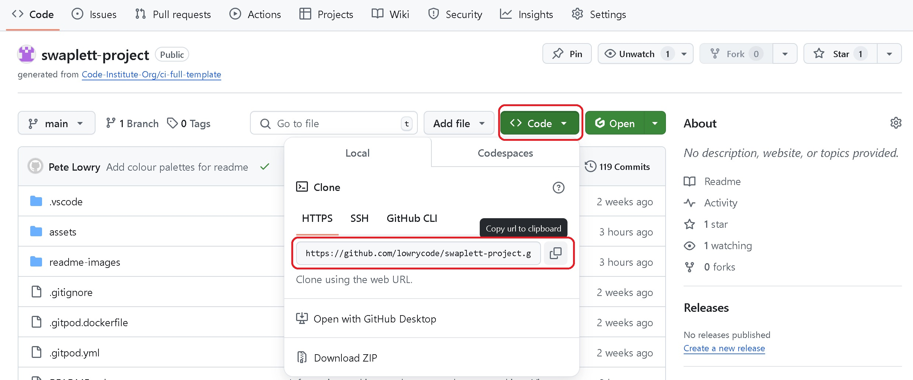

# Swaplett

Swaplett is a word puzzle game where players complete a grid of words by swapping letters into their correct positions. Letters can be moved by dragging them with a mouse or finger (on touch-screen devices). To win the game, players have to complete the grid within 15 swaps.

The project uses a third-party API (<a href="https://dictionaryapi.dev/" target="_blank" rel="noopener">**Free Dictionary API**</a>) to fetch information about words such as their meanings and links to pronounciation audio clips.

You can visit the deployed website <a href="https://lowrycode.github.io/swaplett-project/" target="_blank" rel="noopener">**here**</a>.
 


# Project Planning

The [**Project Planning**](project_planning.md) document outlines my personal goals for the project as well as the pseudo code for the JavaScript functionality.

# User Experience (UX) Design

## Responsive Design

The website was developed using a mobile-first approach, ensuring an optimized experience for mobile users before adapting to larger screens. This applies to functionality (e.g. touch events for dragging letters across the grid), layout (using `Flexbox`), and sizing (using relative units like `rem`, `%`, and `vh`). The custom `.container` class, combined with media queries, keeps content centered and prevents it from stretching too wide on larger screens.

Wireframes were produced using <a href="https://balsamiq.com/" target="_blank" rel="noopener">**Balsamiq**</a> at the earliest stages of planning to ensure an effective layout across different devices.


During development, the decision was made to give the header the same background colour as the main body as this was judged to create a more seamless and cohesive page design.

## Visual Design

### Colour Palette

Colours were selected for good visual contrast. Common conventions were followed (e.g. green is associated with correct, red is associated with incorrect, etc.).

The user can choose between two different colour themes. The colour palette of each theme is shown below.




### Typography

The **Nunito** font (with a sans-serif fallback) was used throughout the website page due to
- its casual game-like feel
- its versatility (with a wide range of font weights)
- being easy to read.

### Game Logo Design

The game logo uses a font called **Carter One** and was designed using <a href="https://www.canva.com/" target="_blank" rel="noopener">**Canva**</a> and then edited using <a href="https://www.gimp.org/" target="_blank" rel="noopener">**GIMP**</a>.


The colour theme ensures a good colour contrast when using both light mode and dark mode. A png file format was chosen to allow for a transparent background.

## User Interaction Design

The following features aim to ensure an enjoyable user experience when interacting with the site:

- **Intuitive Design** - icons use standard conventions (e.g. a toggle switch for dark-mode, a question mark icon for instructions), "X" button for closing modals (positioned in top right), placeholder instructions on game-board (shown on initial page load)
- **Text Legibility** - legible font (sans-serif), suitable text size and spacing, good colour contrast between text and background
- **Consistent Style** - similar elements look and behave in a similar way (e.g. colour themes for clickable buttons, hyperlinked text, select boxes, modals)
- **User Feedback** - hover effects (e.g. colour changes, tooltips, mouse cursor changes) to show interactive elements, in-game feedback (colour of grid cells, count of remaining swaps), end of game feedback (win / lose message displayed), elements in focus show outline (e.g. when using tab key to cycle through elements)
- **Transition Effects** - Smooth transitions for hover events and toggling dark mode colour theme

## Accessibility

The webpage is primarily designed for touch screen devices and so draggable elements can be moved using finger swipes. However, mouse drag-and-drop events are also supported for those accessing the website from a laptop / desktop computer.

The following features are included to assist screen readers:
- **Semantic HTML**
- **Form labels** - associated with inputs (though these are visibly hidden from the screen)
- **Alt text** - used to describe images
- **Aria-labels** - used for buttons, icons and checkboxes (e.g. buttons for playing audio clips or closing modals, checkbox  close modal buttons, dark-mode toggle switch)
- **Aria-labelledby** - used for identifying the relevant modal (instructions or alert)
- **Aria-checked** - used on toggle switch to indicate whether dark-mode is activated
- **Aria-hidden** - for elements that are only used for aesthetics (e.g. icons) or for hidden functionality (e.g. audio elements)

## Performance

### Optimised Images

Images have been optimised to ensure fast page loading. Since transparency was required, WebP formats could not be used so carefully scaled PNG files were used instead to maintain a balance between small file sizes and sufficient resolution.

### Efficient Data Structures and Algorithms

The interactive elements on the page respond quickly, thanks to the use of efficient data structures and algorithms within the JavaScript code.

Here are some examples: 

**1. Tracking Game State Using `unresolvedGridCells`**

In order to quickly determine when a user has successfully completed the grid, a variable called `unresolvedGridCells` is used to record which grid cells are still unresolved. This is implemented as a `Set`, rather than an `array`, to take advantage of the more efficient lookups (using hash mapping) and therefore quicker removal of items.

**2. Parallel Asynchronous Requests Using `Promise.all`**

At the end of the game, the `fetchDefinitionsArr` function is called to fetch the definitions (and other word info) from the (<a href="https://dictionaryapi.dev/" target="_blank" rel="noopener">**Free Dictionary API**</a>) for each of the words used in the game. During the early stages of development, each of these requests were made in sequence using `async/await`. This led to a noticeable bottleneck where the code was waiting for the API to respond before sending the next request.

This issue was resolved by using the `Promise.all` method, which sends the requests in parallel and returns a single promise that resolves when all of the individual promises have resolved successfully.

```js
async function fetchDefinitionsArr(wordsArr) {
    return Promise.all(wordsArr.map(fetchWordInfo));
}
```

This approach led to a noticable reduction in the time taken to retrieve the definitions.

***NOTE:*** *Someone may ask why the definitions were not fetched in advance (i.e. when the grid was first generated) to avoid the user having to wait for them at the end of the game. This approach was avoided because:*
(a) ***it avoids sending unnecessary requests to the API***: *if the user abandons the game early, there was no need to make the request*
(b) ***it allows for better error handling***: *the user could still play the game even if the definitions could not be retrieved after the game has ended*

**3. Randomising Arrays Using Fisher-Yates (Knuth) Shuffle Algorithm**

This is a well known and very efficient algorithm for shuffling arrays. It is discussed in more detail in the [JavaScript Logic section](#logic) below.

# Current Features

## Header Section

### Toggle Switch For Dark Mode

Users can toggle between light mode and dark mode using the toggle switch in the top left corner. Light-mode is selected by default.


Hovering over the toggle switch causes the background colour to change slightly and a tooltip to appear. An `aria-label` and `aria-checked` attribute is used to assist screen readers.

When the switch is in focus, an outline is shown around the switch. This supports users who cycle to this element using the tab key.

Pressing the switch causes a smooth transition to the other colour theme. The colour of the switch changes to reflect the new theme and the position of the slider moves to the right (for dark mode) or left (for light mode). 

***NOTE:*** *An event listener is attached to this element in script.js. When dark mode is activated, the script adds the `.dark-mode` class to the document body element. This approach maintains separation of concerns by keeping styles in the CSS file (instead of modifying them directly with JavaScript inline styles). The `aria-label` is also updated to enhance accessibility for screen readers.*

### Swaplett Game Logo

The logo in the centre of the header is for improving the aesthetics of the page and is not interactive.

### Icon To Open Instructions Modal

Clicking on the "btn-show-instructions" button in the top right of the screen reveals a modal with written instructions about how to play the game. The modal can be closed again by pressing the "X" button in the top right corner of the modal.


Hovering over both the "btn-show-instructions" and "X" buttons causes the background colour to change slightly and a tooltip to appear. An `aria-label` is used to assist screen readers.

When the buttons are in focus, an outline is shown around them to support users who cycle to this element using the tab key.

***NOTE:*** *The instructions modal is initially assigned a class called `.hidden` which removes it from the DOM and hides it from screen readers until the user chooses to open it. An event listener is attached to both the "btn-show-instructions" button and the "X" buttons in script.js to add / remove the `.hidden` class from this modal.*

## Game Settings Section

The Game Settings section appears directly underneath the header and remains visible throughout the game. It includes two `select` inputs and a `button`. All three elements have identical dimensions (width and height) and are dynamically positioned using `flexbox`.


The two `select` boxes have identical styles and behaviours (e.g. hover effects) and each have an associated `label` (included for semantic reasons as they benefit screen readers) although these are not visible on the screen.

The New Game `button` adopts the same style as the clickable elements in the header for consistency.

### Grid Size Select Input

This is used to choose the grid size and therefore the length of the words. It is set to 5x5 by default but can be set to one of the following: 3x3, 4x4, 5x5, 6x6 or 7x7.

### Difficulty Level Select Input

This is used to choose the difficulty level of the game and relates to the number of swaps that are required to complete the grid. Players must always complete the grid within 15 swaps to win the game.

***NOTE:*** *When the grid of words is initially generated, the completed grid is generated first and then it is jumbled up by making a specified number of random swaps to the position of letters. The difficulty level specifies the number of swaps that are made:*
*- EASY - 6 swaps*
*- MEDIUM - 8 swaps*
*- DIFFICULT - 10 swaps*

*It is possible that a swap may be undone by a subsequent swap and therefore in reality it is possible to complete the grid in fewer swaps than the numbers specified above.*

### New Game Button

Clicking this button starts a new game by:
1. **Resetting the visible elements on the page**
    - the count of remaining swaps is updated
    - the relevant DOM elements are shown / hidden
    - a placeholder text ("Generating board...") is added to the gameboard
2. **Building the grid of words**
    - an `array` of words of the correct length is fetched from the relevant JSON file in the **assets > json** directory and the `array` is then shuffled to randomise the order of these words
    - a smaller collection of these words are chosen if they together meet the criteria for the specified grid (i.e. their intersecting characters match)
    - the characters of each word are assigned to a 2D `array` (called `gridAnswerArr`) which stores their correct positions (i.e. row and column) in the grid
    - a copy of the `gridAnswerArr` (called `gridArr`) is jumbled by making a specified number of swaps (as determined by the difficulty level) - this becomes the initial state of the grid
    - the grid is drawn on the page (by dynamically writing HTML into the game-board section)
3. **Adding event handlers to the grid cells**
    - these relate to the drag-and-drop functionality

***NOTE:*** *if the random words cannot be fetched from the JSON file (e.g. no internet connection), an alert message is displayed to the user via the alert modal.*

## Game Board Section and Game Functionality

On initial page load, the game board section displays the message: *"Choose your settings, then click the NEW GAME button above"*. When the New Game button is clicked, this text briefly changes to *"Generating board..."* while the grid is being created. Once the grid is ready (usually almost instantly, but sometimes within a couple of seconds) it replaces the message.


The grid cells contain the letters from the words in the grid and have one of 3 background colours:
- **GREEN** -  this indicates that the letter is in the correct position. The grid cell will not be draggable and lacks any hover effects (indicating that users cannot interact with this grid cell). 
- **YELLOW** -  this indicates that the letter is found elsewhere in the same row and / or column. The grid cell is draggable and hover effects are used to indicate this (the mouse cursor shows a pointer).
- **GREY** -  this indicates that the letter is not found in the same row or column. The grid cell is draggable and hover effects are used to indicate this (the mouse cursor shows a pointer).

***NOTE:*** *the hover effects are managed by the `.draggable` class which is applied to all draggable grid cells and removed when a grid cell stops being draggable.*

When a user drags a draggable grid cell (by holding down a finger or mouse click whilst moving), the grid cell becomes semi-transparent and hovers over other elements. When it is dropped onto another grid cell, if both grid cells are draggable and do not contain the same letter, the following things will happen:
- letters will swap positions (both visually on the screen and by updating `gridArr`)
- the count of remaining swaps will decrement by 1
- the new positions of the letters are evaluated and background colours are updated if required
- if a letter is now in the correct position, the `.draggable` class is removed from that grid cell (to remove hover effects) and event listeners are also removed (to remove drag-and-drop behaviour)
- the state of the game is evaluated (to see if the game has ended)

If the game has ended (due to all grid cells being green or no more swaps remaining), the following actions occur:
- the count of remaining swaps is hidden
- the relevant win / lose message is displayed
- all drag-and-drop event listeners are removed from any remaining draggable elements (this only applies when the user loses the game)
- an API request fetches the definitions of the words (or an alert box is shown if the request fails)
- the definitions are displayed on the screen

***NOTE:*** *if the word is not found in the dictionary API, a 404 error is returned. The script handles this error by printing "No definition found".*

## Remaining Swaps Section

This section shows the count of how many swaps are remaining. Every game allows the user a maximum of 15 swaps to complete the grid. The count is updated (decreased by 1) after every swap.


***NOTE:*** *if a swap is not valid (e.g. when a user attempts to swap two grid cells which contain the same letter), the count of remaining swaps is not decremented for that attempt.*

This section is only visible during game play - it is hidden on initial page load and at the end of each game.

***NOTE:*** *This section is initially assigned a class called `.hidden` which removes it from the DOM and hides it from screen readers until the game starts. When the game starts, the `.hidden` class is removed.*


## Game End Section

This section shows the relevant win or lose message at the end of the game.


This section is only visible at the end of the game - it is hidden on initial page load and during game play.

***NOTE:*** *This section is initially assigned a class called `.hidden` (along with the child sections for win and lose messages) which removes them from the DOM and hides them from screen readers until the game ends. When the game ends, the `.hidden` class is removed from this section and the relevant child section (win or lose section) causing the message to be shown. The `.hidden` class is reassigned when a new game begins.*

If the user only had 1 swap remaining, the win message displays the correct grammar by writing **swap** (singular) rather than **swaps** (plural).

## Definitions Section

This section shows the definitions of any words that were used in the grid. The HTML for this section is generated dynamically.


Since these definitions are fetched from a third-party API, sometimes these definitions cannot be found - if so, a "No definition found" message will be displayed.

Sometimes links to audio clips (of word pronounciations) are included - if so, a circle-play button appears next to the word which includes hover effects (to show that it is clickable). The audio clip will play when the user clicks the button.

This section is only visible at the end of the game - it is hidden on initial page load and during game play.

***NOTE:*** *This section is initially assigned a class called `.hidden` which removes it from the DOM and hides it from screen readers until the game ends. When the game ends, the `.hidden` class is removed from this section causing the definitions to be shown. The `.hidden` class is reassigned when a new game begins to hide it again.*

## Footer

The footer sits at the bottom of the page and includes a link to the GitHub repository. The GitHub icon matches the styling of other hyperlinks and shares the same hover effects so that users recognise it as a clickable element.


## Instructions Modal

As discussed [previously](#icon-to-open-instructions-modal), the instructions modal can be opened by clicking on the `btn-show-instructions` button (the circle-question-mark icon) in the top right corner of the page.

The modal consists of:
- a dark semi-transparent overlay (to darken the main page content)
- the main dialogue box (which sits above the overlay)

On smaller screens, the dialogue box takes nearly the full width of the screen but on larger screens it is centred with a maximum width of 700px.


### Modal Header

The header of the dialogue box includes the modal title ("Instructions") and the "X" close button with appropriate hover effects (colour change and tool tip). It remains fixed at the top of the modal.

### Modal Body

This includes the instructions for the game and is split into sections which are separated by horizontal lines. A vertical scroll bar allows users to navigate easily through the content.

### Modal Footer

The modal "footer" section is not a footer in the true sense but rather the last section within the modal body - it is included within the flow of the scrollable body section.

It shows some additional information about the project including:
- a hyperlink to the game that inspired it
- a hyperlink to the Code Institute website (since this project was developed as part of the Level 5 Diploma course)

All hyperlinks on the webpage are styled consistently using the same colour and hover effects.

## Alert Modal

This modal is designed for showing significant notifications to the user and is dynamic by nature (allowing the title and message to be set at runtime). It is currently used for showing when an error occurs (e.g. when an API request fails).


The styling is very similar to the instructions modal but these modals have a smaller maximum width of 480px.

# Possible Future Features

Here are some possible features which would further enhance the user experience:
1. Use `localStorage` to:
    - flag whether a user is a first-time visitor (so can prompt them to read the instructions and learn about the game)
    - save user preferences about colour theme (so can automatically turn dark-mode on for users who prefer this theme) 
2. Add animations at the end of the game to reward users who complete the grid successfully
    - these would be subtle and short (to prevent users becoming irritated by them)
    - perhaps the animations would involve cycling through the grid cells and enlarging them
3. Improve the design of the end of game messages
    - perhaps replace the text with an image and include a zoom animation
4. Restore scroll and swipe behaviours on grid cells at the end of the game
    - currently all default events have been removed from grid cells to allow for better control of the drag and drop behaviours during game play
5. Expand the word banks
    - this would allow for greater variation between games but could potentially have a negative effect on the time taken to generate the grid of words
6. Check all words in the word banks are included as entries in the dictionary API
    -  this would ensure that the "No definition found" message is not displayed to the user
7. Use more obscure words when the difficulty level is set to "Hard"
    - this would require addtional JSON files for storing these words
    - it is more likely that these words would not be found when using the dictionary API

# JavaScript Code

Since the aim of this project was to build an interactive website using JavaScript, this section gives special consideration to the JavaScript code itself. The [**Project Planning**](project_planning.md) document summarised my goals in demonstrating best coding practices with regards to *readability*, *maintainability* and *logic* so the code will be considered under these three headings.

## Readability

The code follows standard JavaScript conventions. For example:
- **Variables and Functions:** have meaningful names and are written in camelCase (e.g. `newGame()`, `wordLength`)
- **Constants:** are written in UPPER_CASE (e.g. `MIN_WORD_LENGTH`, `MAX_WORD_LENGTH`)
- **Code Indentation:** use 4 spaces consistently for easily reading code blocks
- **Semicolons:** used consistently (as verified by JSHint)
- **Template Literals:** using back-ticks with `${placeholder}` instead of string concatenations
- **Comments:** used to organise and explain code
- **JSDocs:** used to document all main functions and helper functions

These features ensure that the code is easily understood by other Javascript developers and allows for better collaboration.

## Maintainability

### Separation of Concerns

The way the project is structured ensures that there is a good separation of concerns:
- The main HTML file (**index.html**) deals with the content and structure of the page.
- All css styling rules are written in an external stylesheet (**style.css**) rather than embedded within `style` tags within the header of the HTML file.
- All JavaScript functionality is written in an external js file (**script.js**) rather than embedded within `script` tags within the body of the HTML file.

Event listeners are defined within the JavaScript file (rather than with inline event attributes like `onclick`).

When JavaScript is used to modify the styling and visibility of elements, it typically does so by adding or removing classes. This approach ensures that styling rules remain exclusively in the stylesheet, maintaining a clean separation between behaviour and presentation. However, when creating the grid cells in the `createGridCell` function, JavaScript is allowed to specify the heights and widths of these elements. This is necessary because the grid dimensions depend on the size chosen by the user, and these values must be calculated dynamically rather than predefined in the stylesheet.

### Code Reusability

There is also a logical separation of functionalities with each function focusing on a single task. This is known as the **Single Responsibility Principle** and ensures that the code is modular and reusable (following the *DRY principle*).

For example, the `makeSwap` function is called whenever a user makes a valid swap on the grid. This function involves carrying out a number of procedures but rather than incorporating all of them directly within this function, each procedure is abstracted into its own helper function:
- **`updateGridArr`:** This function updates the array which stores the letters at each location in the grid.
- **`updateGridCellContents`:** This function updates the page display to show the new positions of letters within the grid.
- **`setGridCellClassNames`:** This function ensures that each grid cell has the relevant classes assigned (`.draggable`, `.green`, `.yellow`) as dictated by the position of the letter in the grid. *This function is called for both the dragged cell and the target cell and is also used by the `drawGrid` function when initially setting up a new game.*
- **`processResolvedGridCells`:** This function checks if a grid cell is resolved (i.e. the letter is in the correct position) and, if so, removes drag events from the cell and removes its coordinates from the `unresolvedGridCells` `set`. *This function is called for both the dragged cell and the target cell separately.*
- **`endGame`:** This function is conditionally called if the game has ended and handles multiple procedures that are called at the end of the game.

Structuring the code in this way ensures that it is easy to understand, modify and test.

### Code Extensibility

The code was also written with extensibility in mind. For example, the HTML structure of the modals is consistent and uses the same class names. This means that the same styling rules can be applied to existing modals and any others added in the future. It also has the benefit that JavaScript can target all of the modal close buttons and apply the same event listener to all of them, even ones added in the future.

```js
const closeButtons = document.getElementsByClassName("btn-close-modal");
for (let btn of closeButtons) {
    btn.addEventListener("click", (e) => {
        let modalElement = e.target.closest(".modal-overlay");
        modalElement.classList.add("hidden");
    });
}
```

This approach ensures that there is minimal disruption to the code when new features are added.

### Minimising Bugs

To make the code more robust and easier to debug, a number of best practices were adopted.

**1. Variables defined in block scope**

Older Javascript code used the `var` keyword when defining variables. This approach to defining variables is more error prone because the variable is function scoped and accessible throughout the whole function in which it is declared. The variable could be accidentally re-declared and modified later in the function. Global variables were also avoided for similar reasons.

This project used the more robust and modern approach which is to define variables in block scope using the `let` and `const` key words. This prevents bugs caused by accidentally re-declaring variables later in the code. Using `const` for variables that should remain unchanged within the block also helps to catch bugs caused when changing the values of these variables.

***NOTE:*** *variables which are not defined using one of the three declaration words above become global variables by default. Therefore, the code was checked using the JSHint website to ensure that all variables were exlicitly defined.*

**2. Strict Equality and Type Coercion**

When doing logical comparisons, strict equality (`===` or `!==`) was used in preference to loose equality (`==` and `!=`) since loose equality allows implicit type coercion and is harder to debug. 

When type conversion is required, a better approach is to handle the type conversion manually to ensure clarity and avoid unexpected behaviour. This was needed in the following cases:
- when converting data from form inputs (from text to numbers)
```js
const wordLength = parseInt(document.getElementById("grid-select").value);
```
- when converting data from element attributes (e.g. when getting the row number of a grid cell)
```js
let r1 = parseInt(draggedElement.getAttribute("data-row"));
```

**3. Avoiding Deep Nesting**

Code that involves deeply nested logic is difficult to read and debug so this was avoided using logical operators to check multiple conditions at the top level.

For example, in the jumbleGridArr function, multiple `&&` operators are used to check criteria within a while loop as follows:

```js
// Check swap is valid
if (jumbledGridArr[r1][c1] !== null &&
    jumbledGridArr[r2][c2] !== null &&
    jumbledGridArr[r1][c1] !== jumbledGridArr[r2][c2] &&
    jumbledGridArr[r1][c1] !== gridArr[r2][c2] &&
    jumbledGridArr[r2][c2] !== gridArr[r1][c1]
) {
    // Make the swap
    ...
}
```

For asynchronous operations, using promises with `.then` can sometimes lead to deeply nested `.then` chains. This was avoided by using `async/await` instead.

**4. Error Handling**

When errors occur in helper functions, they are propagated upwards to the caller function and handled at a higher level using `try/catch` blocks. This approach ensures that error messages displayed to the end user are managed efficiently, reducing code repetition and maintaining a clear separation between error detection and user-facing error handling.

## Logic

There are lots of things that could be discussed in relation to the code logic! For example: 
- the use of asynchronous methods when fetching data from an external API
- the way that both touch and mouse drag-and-drop events were managed in the `onDragStart`, `onDragMove` and `onDragEnd` functions

However, the most challenging (and interesting) aspect of the project relates to how to get a random collection of words which match the criteria of the specified grid (i.e. have intersecting characters in the correct positions).

The process involves the following steps
1. Fetching words of the correct length
2. Randomising the order of the words
3. Defining the grid criteria
4. Finding words which meet the criteria

Each of these steps are considered in more detail below.

### 1. Fetching words of the correct length

The `fetchRandomWords` function is tasked with fetching a large number of words (of a specified length) and returning the result as a randomly shuffled array.

```js
async function fetchRandomWords(wordLength) {

    // Validate input
    const MIN_WORD_LENGTH = 3;
    const MAX_WORD_LENGTH = 7;
    if (!Number.isInteger(wordLength) || wordLength < MIN_WORD_LENGTH || wordLength > MAX_WORD_LENGTH) {
        throw new Error(`Invalid word length - must be between ${MIN_WORD_LENGTH} and ${MAX_WORD_LENGTH}`);
    }

    // Write query string
    const filePath = `assets/json/wordbank-${wordLength}-letters.json`;

    // Fetch data
    try {
        const response = await fetch(filePath);

        if (!response.ok) {
            // Fetch request (was successful but) returned a HTTP error
            throw new Error(`HTTP error (status: ${response.status})`);
        }

        const data = await response.json();
        shuffleArray(data);  // Shuffles data (the array of words) in place
        return data;

    } catch (error) {
        // Includes network errors, JSON parsing errors, and runtime errors
        throw error;  // to be handled by the caller function
    }
}
```

In early stages of development, the function fetched words from the <a href="https://random-word-api.herokuapp.com/home" target="_blank" rel="noopener">Random Words API</a>. This API allows you to specify:
- the length of the words
- the language of the words
- how many words are returned

The results are returned as a randomly sorted array which is perfect for the use case here. However, due to significant periods of downtime, the obscurity of some of the words returned and the need for a blacklist, this turned out to not be an ideal solution.

The function now fetches the words from one of 5 JSON files which are stored within the **assets > json** directory. These files include a large array of words, each of a specified length, written in JSON format.

This approach overcame the difficulties that arose when using the Random Word API but the words were no longer returned in a random order. The `shuffleArray` function was used to randomise the order of these words before returning them.

### 2. Randomising the order of the words

The `shuffleArray` function uses a well known algorithm called the *Fisher-Yates (Knuth)* Shuffle Algorithm.

```js
// Code adapted from https://stackoverflow.com/questions/2450954/how-to-randomize-shuffle-a-javascript-array
function shuffleArray(arr) {
    for (let i = arr.length - 1; i >= 0; i--) {
        const j = Math.floor(Math.random() * (i + 1));
        [arr[i], arr[j]] = [arr[j], arr[i]];
    }
}
```

The algorithm works by looping through the array (in reverse order) and swapping that array item with an earlier item (or itself) which is chosen at random. This is a good approach because
1. **it ensures the array is truly random** - every possible arrangement of the array has the same probability 
2. **it is time efficient** - the time complexity is O(n) since the algorithm only makes one pass of the array
3. **it is space efficient** - the array is modified *in place* so no extra memory is required

***NOTE:*** *the above implementation of the algorithm uses destructuring assignment in order to swap the array items. This approach makes the swap operation more concise and readable while eliminating the need for an explicit temporary variable like in the equivalent code below:*
```js
let temp = arr[i];
arr[i] = arr[j];
arr[j] = temp;
```

### 3. Defining the grid criteria

Each grid of words involves intersecting characters between certain words. The positions of these intersecting characters depends on the size of the grid. For example, in the grids shown below:
- **5x5 grid:** the first character of the word in the middle column (INDIE) must match the **THIRD** character of the word in the top row (GRIEF)
- **7x7 grid:** the first character of the word in the middle column (PROTECT) must match the **FOURTH** character of the word in the top row (YAPPING)



In order to summarise the criteria for each grid:
- each word was assigned a word index between `0` and `n-1` (where `n` is the number of words in the grid)
- each character within the word is assigned a character index between `0` and `l-1` (where `l` is the length of the word)

When assigning each word an index, the rows were assigned first (top to bottom) and then the columns were assigned (left to right). This is illustrated in the image below.



A 2D array (called `criteria`) was used to summarise the criteria for each grid. Each array item consists of a 4 element array and takes the format as shown in the image below.



Since the criteria changes depending on the grid size, the `getGridWordsCriteria` function is used to assign the relevant array to the `criteria` variable. Using a function (rather than one big object containing all of the arrays) was judged to be easier to understand, maintain and extend if needed.

```js
function getGridWordsCriteria(wordLength) {
    switch (wordLength) {
        case 3:
        case 4:
            return [
                [0, 2, 0, 0],
                [0, 3, 2, 0],
                [1, 2, 0, 2],
                [1, 3, 2, 2]
            ];
        case 5:
        case 6:
            return [
                [0, 3, 0, 0],
                [0, 4, 2, 0],
                [0, 5, 4, 0],
                [1, 3, 0, 2],
                [1, 4, 2, 2],
                [1, 5, 4, 2],
                [2, 3, 0, 4],
                [2, 4, 2, 4],
                [2, 5, 4, 4]
            ];
        case 7:
            return [
                [0, 3, 0, 0],
                [0, 4, 3, 0],
                [0, 5, 6, 0],
                [1, 3, 0, 3],
                [1, 4, 3, 3],
                [1, 5, 6, 3],
                [2, 3, 0, 6],
                [2, 4, 3, 6],
                [2, 5, 6, 6]
            ];
        default:
            throw new Error("Invalid wordLength passed as argument");
    }
}
```

### 4. Finding words which meet the criteria

The `assignGridWords` function is responsible for finding a collection of words that meet the criteria for the grid. It uses **recursion** to perform a **depth-first search** until all grid words are assigned.

```js
function assignGridWords(words, gridWords, criteria, usedWords = new Set(), wordIndex = 0) {
    // Base case
    if (wordIndex >= gridWords.length) return { data: gridWords, success: true };

    // Recursive backtracking
    for (let word of words) {
        // Check word is not already used
        if (usedWords.has(word)) continue;
        
        // Provisionally add word
        gridWords[wordIndex] = word;
        usedWords.add(word);
        
        // Check word against criteria
        if (matchesCriteria(wordIndex, gridWords, criteria)) {
            // Recursive call
            const response = assignGridWords(words, gridWords, criteria, usedWords, wordIndex + 1);
            if (response.success) return response;
        }

        // Backtrack
        gridWords[wordIndex] = null;
        usedWords.delete(word);
    }

    // If reaches here, no valid word found for this position
    return { data: gridWords, success: false };
}
```

The function returns an object with the following properties:
- `success`: A boolean indicating whether the word was assigned successfully (i.e. passed the criteria checks)
- `data`: The updated `gridWords` array

Here is a detailed breakdown of how the function works...

**(a) The initial call**

The function is first called from the `newGame` function and takes the following parameters:
- `words`: The randomly shuffled array of words that was returned by the `fetchRandomWords` function (see step 1)
- `gridWords`: The array where the words meeting the criteria are stored
    - ***NOTE:*** *Before the function is first called, this array is initialised (by the `initialiseGridWords` function) as a null filled array with a length matching the number of words required by the grid.*
- `criteria`: The array specifying the criteria for the grid (see step 3)
- `usedWords`: A `set` containing words that have already been assigned in the `gridWords` array
    - ***NOTE:*** *This is not explicitly defined when first called by the newGame function but is assigned as an empty `set` by default.*
- `wordIndex`: The index for the word currently being assigned in the `gridWords` array
    - ***NOTE:*** *This is not explicitly defined when first called by the newGame function but is assigned a value of `0` by default. It also relates to the word index used in the `criteria` array.*

**(b) The Base Case**

As is common in recursive functions, the **base case** comes first. This ensures that the function returns immediately when a solution is found without making unnecessary recursive calls thus optimising performance.

The base case in this function involves checking whether all positions in `gridWords` have been filled. This will be the case when `wordIndex` exceeds the length of the `gridWords` array.
- If this is the case, the function returns a successful result.
- If not, the function will continue the search

**(c) Recursive Backtracking**

The function loops through the words in the randomly shuffled `words` array and first checks whether the word is already included in the `gridWords` array. If so, the loop jumps to the next iteration (since we do not want to use the same word twice in the grid).

If the word is not already used, the word is provisionally added to the `gridWords` array and the `usedWords` set. The new state of the `gridWords` array is then tested to see if it meets the criteria for the grid. These checks are made by the `matchesCriteria` function (more details below).

If the new state of the `gridWords` array passes the checks, another recursive call is made to find the next word in the `gridWords` array. If it fails the checks, the word is removed again from the `gridWords` array and `usedWords` set (i.e. backtracked) before moving on to the next iteration.

**(d) Failure Case**

If the last line of the function is reached, no valid word could be found at that depth of search and so the function returns a failure message (`success: false`) to the caller function which then continues the search by iterating to the next word.

If the failure message propogates all the way back to the `newGame` function itself (which made the initial call), the function has exhausted all possible variations of the words and no solution was found. ***NOTE:*** *this will never happen with the current words in the JSON files but it could if the list of words in these files was sufficiently small.*

**(e) Success Case**

If the base case finds that the `gridWords` array has been completed, the function will immediately return the object with a success message.

```js
// Base case
if (wordIndex >= gridWords.length) return { data: gridWords, success: true };
```

Immediately following the recursive call, the state of the `success` property is checked and (if found to be true) the response is immediately propogated up to the caller function.

```js
// Recursive call
const response = assignGridWords(words, gridWords, criteria, usedWords, wordIndex + 1);
if (response.success) return response;
```

Therefore, once a solution is found, the recursion process is immediately halted and the function very quickly returns the solution to the function that made the initial call (without looking for other solutions). This ensures that the function is optimised and that the user is not waiting a long time for the grid to generate.

**(f) The `matchesCriteria` Function**

The `matchesCriteria` function is responsible for checking whether the words in the `gridWords` array match the criteria specified for the grid in the `criteria` array.

The function takes the following parameters:
- `lastIndex`: The index of the most recently added word to the `gridWords` array
- `gridWords`: The current state of the `gridWords` array (including the provisionally added word)
- `criteria`: The `criteria` array for the specified grid

The function returns a boolean value:
- `true`: If the current state of `gridArray` passes all checks
- `false`: If the current state of `gridArray` fails one of the criteria in the `criteria` array

```js
function matchesCriteria(lastIndex, gridWords, criteria) {
    for (let [iGridWord, jGridWord, iChar, jChar] of criteria) {
        if (((iGridWord === lastIndex || jGridWord === lastIndex)) &&
            gridWords[iGridWord] && gridWords[jGridWord] &&
            (gridWords[iGridWord][iChar] !== gridWords[jGridWord][jChar])
        ) {
            return false;
        }
    }
    return true;
}
```

The function loops through each item in the `criteria` array and first checks whether the criteria relates to the newly added word by checking if either word index matches `lastIndex`. This approach ensures that any irrelevant checks are skipped over and optimises the performance of the function.

It then checks that both words have been assigned a value in the `gridWords` array. This check is necessary because if a word later in the array has not yet been assigned, the first word has not yet been shown to be invalid.

The final check is to see if the criteria rule is broken by comparing the relevant characters in each word.

If all of these conditions are met, the current state of gridWords has failed to meet the criteria and so the function returns immedietely with a value of `false`. This ensures that there are no unnecessary iterations and optimises the performance of the function.

If after iterating through all the criteria the function has not already been terminated, this means that the current state of `gridArray` has passed all the criteria checks and the function returns with a value of `true`.


# Deployment

The website was deployed using **Github Pages** in the early stages of development to allow for testing on multiple devices.

The following steps were taken to deploy the website using Github Pages:
1. Within the Github repository, click on **Settings** in the top navigation bar
2. Choose **Pages** in the left navigation menu
3. In the Source section, choose **Deploy from a branch**
4. In the branch section, choose **main** (or whichever branch you wish to deploy) and click **Save**



# Forking and Cloning

**Forking** refers to making a copy of the repository in your own Github account.

To fork this repository:
1. Log in to your Github account
2. Navigate to the repository page, click the caret (down arrow) next to the fork button and choose **Create a new fork**.



**Cloning** a repository refers to making a copy on your local machine and is typically done after forking.

To clone the repository (assuming you already have git installed on your machine):
1. Navigate to the repository page, click on the **Code** button, ensure the **HTTPS** tab is selected in the dropdown and copy the url
2. On your local machine, create the directory for the cloned repository
3. Open up a terminal window (e.g. **Git Bash** or **Command Prompt** on windows) and navigate to the new directory
4. Type **git clone [url]** (replacing [url] with the url address from step 1) and press Enter


