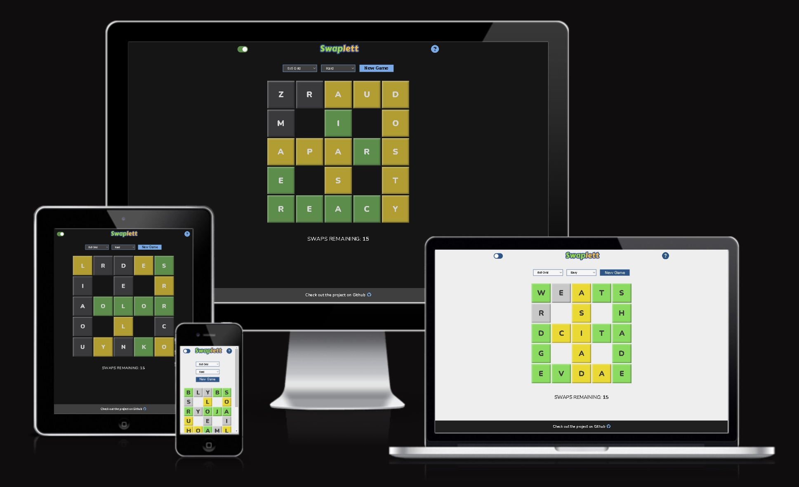
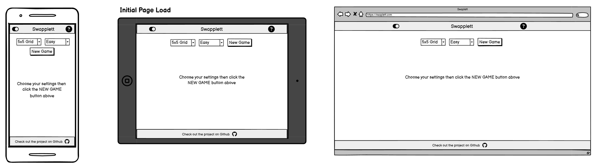
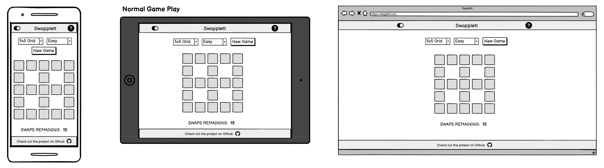
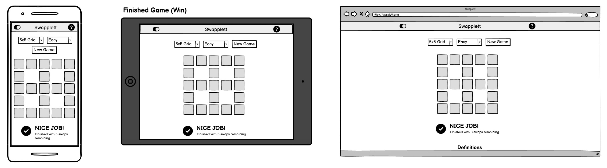
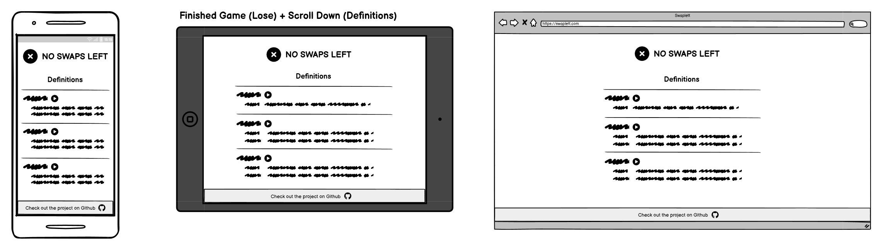
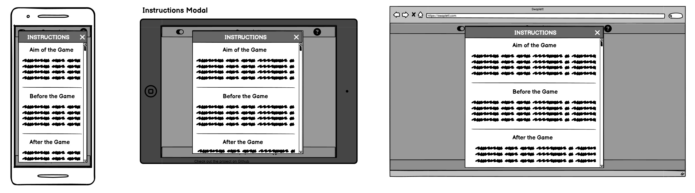
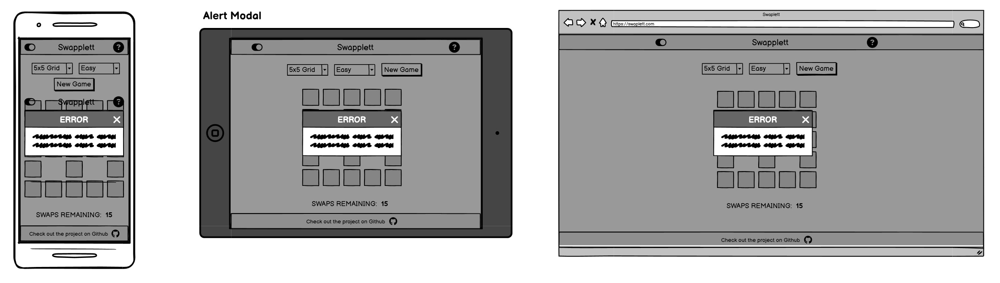
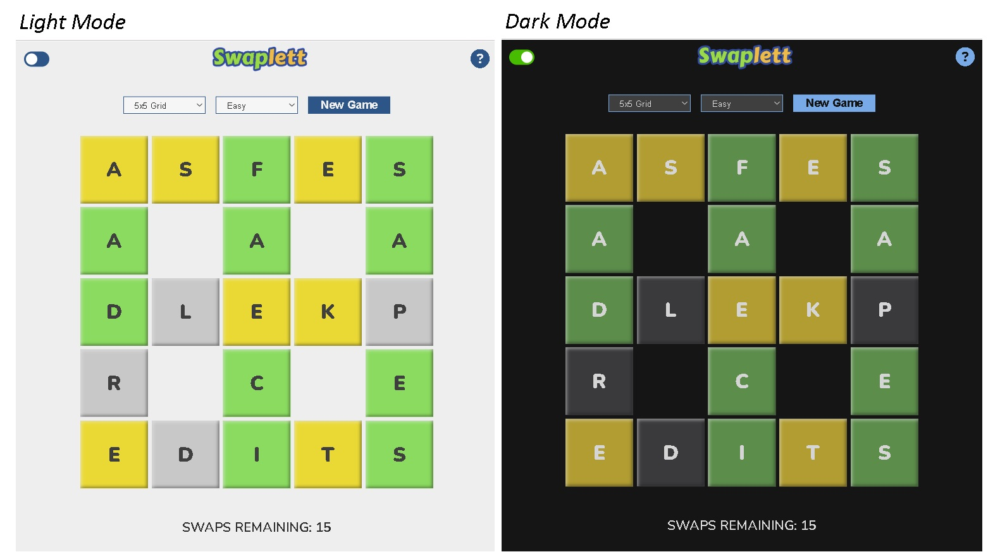
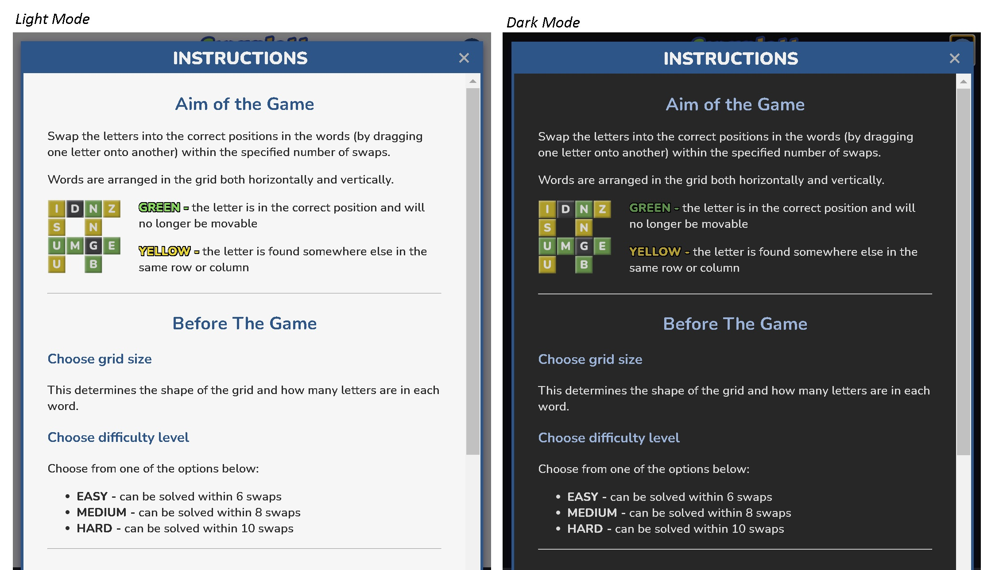
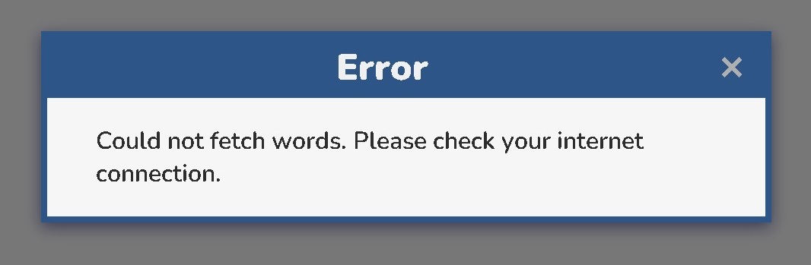

# Swaplett

Swaplett is a word puzzle game where players complete a grid of words by swapping letters into their correct positions. Letters can be moved by dragging them with a mouse or finger (on touch-screen devices). To win the game, players have to complete the grid within 15 swaps.

The project uses two third-party APIs:
- <a href="https://random-word-api.herokuapp.com/home" target="_blank" rel="noopener">**Random Word API**</a> - to fetch a specified number of random words with the correct word length
- <a href="https://dictionaryapi.dev/" target="_blank" rel="noopener">**Free Dictionary API**</a> - to fetch information about the words such as meanings and links to pronounciation audio clips

You can visit the deployed website <a href="https://lowrycode.github.io/swaplett-project/" target="_blank" rel="noopener">**here**</a>.
 

# Project Planning

The [**Project Planning**](project_planning.md) document outlines my personal goals for the project as well as the pseudo code for the JavaScript functionality.

# User Experience (UX) Design

## Responsive Design

The website was developed using a mobile-first approach, ensuring an optimized experience for mobile users before adapting to larger screens. This applies to functionality (e.g. touch events for dragging letters across the grid), layout (using Flexbox), and sizing (using relative units like rem, %, and vh). The custom .container class, combined with media queries, keeps content centered and prevents it from stretching too wide on larger screens.

Wireframes were produced using <a href="https://balsamiq.com/" target="_blank" rel="noopener">**Balsamiq**</a> at the earliest stages of planning to ensure that the webpage had a good layout on different devices.

## User Interaction Design

The following features aim to ensure an enjoyable user experience when interacting with the site:

- **Intuitive Design** - icons use standard conventions (e.g. a toggle switch for dark-mode, a question mark icon for instructions), "X" button for closing modals (positioned in top right), placeholder instructions on game-board (shown on initial page load)
- **Text Legibility** - legible font (sans-serif), suitable text size and spacing, good colour contrast between text and background
- **Consistent Style** - similar elements look and behave in a similar way (e.g. colour themes for clickable buttons, hyperlinked text, select boxes, modals)
- **User Feedback** - hover effects (e.g. colour changes, tooltips, mouse cursor changes) to show interactive elements, in-game feedback (colour of grid cells, count of remaining swaps), end of game feedback (win / lose message displayed), elements in focus show outline (e.g. when using tab key to cycle through elements)
- **Transition Effects** - Smooth transitions for hover events and toggling dark mode colour theme

## Accessibility

The webpage is primarily designed for touch screen devices and so draggable elements can be moved using finger swipes. However, mouse drag-and-drop events are also supported for those accessing the website from a laptop / desktop computer.

The following features are included to assist screen readers:
- **Semantic HTML**
- **Form labels** - associated with inputs (though these are visibly hidden from the screen)
- **Alt text** - used to describe images
- **Aria-labels** - used for buttons, icons and checkboxes (e.g. buttons for playing audio clips or closing modals, checkbox  close modal buttons, dark-mode toggle switch)
- **Aria-labelledby** - used for identifying the relevant modal (instructions or alert)
- **Aria-checked** - used on toggle switch to indicate whether dark-mode is activated
- **Aria-hidden** - for elements that are only used for aesthetics (e.g. icons) or for hidden functionality (e.g. audio elements)

# Features

## Header

### Toggle Switch For Dark Mode

Users can toggle between light mode and dark mode using the toggle switch in the top left corner. Light-mode is selected by default.

Hovering over the toggle switch causes the background colour to change slightly and a tooltip to appear. An aria-label and aria-checked attribute is used to assist screen readers.

When the switch is in focus, an outline is shown around the switch. This supports users who cycle to this element using the tab key.

Pressing the switch causes a smooth transition to the other colour theme. The colour of the switch changes to reflect the new theme and the position of the slider moves to the right (for dark mode) or left (for light mode). 

**NOTE:** An event listener is attached to this element in script.js. When dark mode is activated, the script adds the .dark-mode class to the document body element. This approach maintains separation of concerns by keeping styles in the CSS file (instead of modifying them directly with JavaScript inline styles). The aria-label is also updated to enhance accessibility for screen readers.

### Swaplett Game Logo

The logo in the centre of the header is for improving the aesthetics of the page and is not interactive.

A png file format was chosen to allow for a transparent background.

### Icon To Open Instructions Modal

Clicking on the "btn-show-instructions" button in the top right of the screen reveals a modal with written instructions about how to play the game. The modal can be closed again by pressing the "X" button in the top right corner of the modal.

Hovering over both the "btn-show-instructions" and "X" buttons causes the background colour to change slightly and a tooltip to appear. An aria-label is used to assist screen readers.

When the buttons are in focus, an outline is shown around them to support users who cycle to this element using the tab key.

**NOTE:** The instructions modal is assigned a class called .hidden which removes it from the DOM and hides it from screen readers until the user chooses to open it. An event listener is attached to both the "btn-show-instructions" button and the "X" buttons in script.js to add / remove the .hidden class from this modal.

## Game Settings

The Game Settings section appears directly underneath the header and remains visible throughout the game. It includes two select inputs and a button. All three elements have identical dimensions (width and height) and are dynamically positioned using flexbox.

The two select boxes have identical styles and behaviours (e.g. hover effects) and have associated labels (included for semantic reasons as they benefit screen readers) although these are not visible on the screen.

The New Game button adopts the same style as the clickable elements in the header for consistency.

### Grid Size Select Input

This is used to select the grid size and therefore the length of the words. It is set to 5x5 by default but can be set to one of the following: 3x3, 4x4, 5x5, 6x6 or 7x7.

### Difficulty Level Select Input

This is used to select the difficulty level of the game and relates to the number of swaps that are required to complete the grid. Players must always complete the grid within 15 swaps to win the game.

**NOTE:** When the grid of words is initially generated, the completed grid is generated first and then it is jumbled up by making a specified number of random swaps to the position of letters. The difficulty level specifies the number of swaps that are made:
- EASY - 6 swaps
- MEDIUM - 8 swaps
- DIFFICULT - 10 swaps

It is possible that a swap may be undone by a subsequent swap and therefore in reality it is possible to complete the grid in fewer swaps than the numbers specified above.

### New Game Button

Clicking this button starts a new game by:
1. **Resetting the visible elements on the page**
    - the count of remaining swaps is updated
    - the relevant DOM elements are shown / hidden
    - a placeholder text ("Generating board...") is added to the gameboard
2. **Building the grid of words**
    - an API request fetches an array containing a large number of random words
    - a smaller collection of these words are chosen if they together meet the criteria for the specified grid (i.e. their intersecting characters match)
    - the characters of each word are assigned to a 2D array (called gridAnswerArr) which stores their correct positions (i.e. row and column) in the grid
    - a copy of the gridAnswerArr (called gridArr) is jumbled by making a specified number of swaps (as determined by the difficulty level) - this becomes the initial state of the grid
    - the grid is drawn on the page (by dynamically writing HTML into the game-board section)
3. **Adding event handlers to the grid cells**
    - these relate to the drag-and-drop functionality

NOTE: if the random words cannot be fetched from the API (e.g. no internet connection or the API is down), an alert message is displayed to the user.

