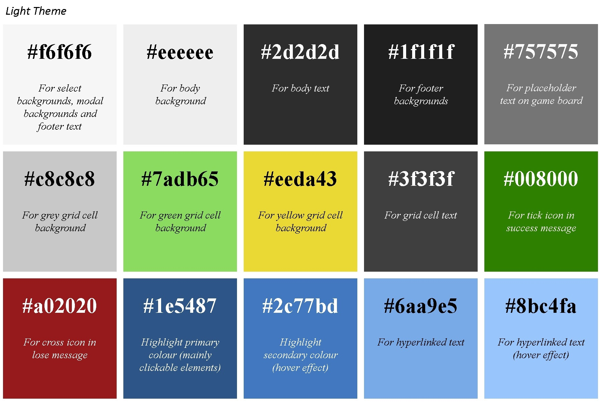
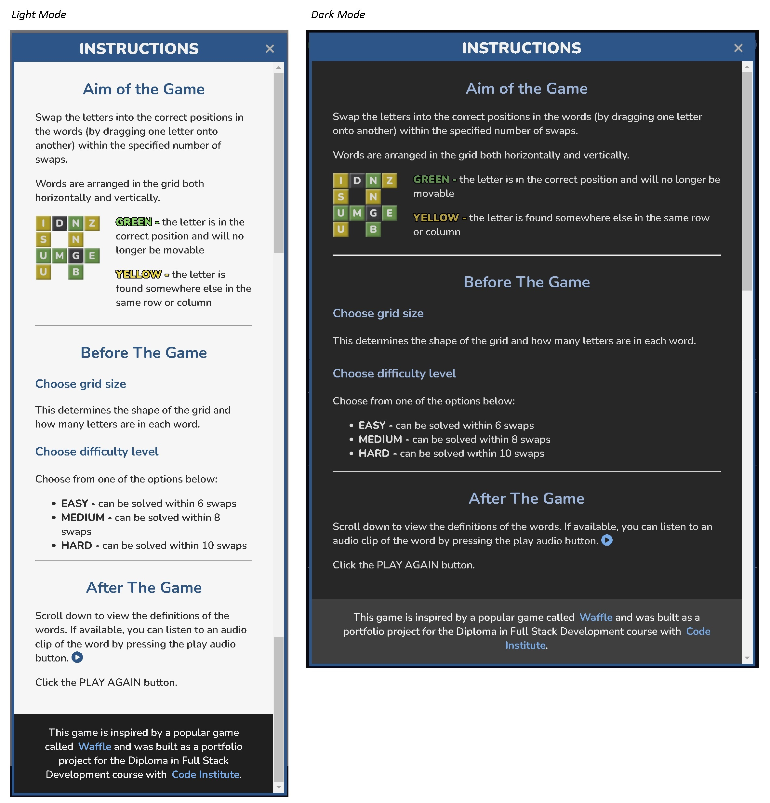
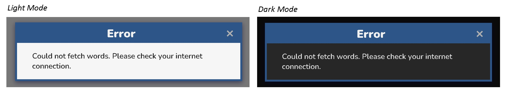

# Swaplett

Swaplett is a word puzzle game where players complete a grid of words by swapping letters into their correct positions. Letters can be moved by dragging them with a mouse or finger (on touch-screen devices). To win the game, players have to complete the grid within 15 swaps.

The project uses a third-party API (<a href="https://dictionaryapi.dev/" target="_blank" rel="noopener">**Free Dictionary API**</a>) to fetch information about words such as their meanings and links to pronunciation audio clips.

You can visit the deployed website <a href="https://lowrycode.github.io/swaplett-project/" target="_blank" rel="noopener">**here**</a>.
 


# Project Planning

The [**Project Planning**](project_planning.md) document outlines my personal goals for the project as well as the pseudo code for the JavaScript functionality. I decided to make a word game which involved swapping the positions of letters because it would allow opportunities to learn more about:
- touch screen events and how to implement drag-and-drop behaviour
- asynchronous programming and how to utilise an API

# Target Audience

The target audience for the website is a user who enjoys playing word games and learning about the definitions of words.

They are most likely to:
- want a quick game that doesn't take too long to learn
- access the website using a mobile phone or tablet device

The game is most likely to appeal to adults but children may also want to play the game. Therefore, the words should not be unsuitable for younger aged users.

# User Experience (UX) Design

## Responsive Design

The website was developed using a mobile-first approach, ensuring an optimized experience for mobile users before adapting to larger screens. This applies to functionality (e.g. touch events for dragging letters across the grid), layout (using `Flexbox`), and sizing (using relative units like `rem`, `%`, and `vh`). The custom `.container` class, combined with media queries, keeps content centered and prevents it from stretching too wide on larger screens.

Wireframes were produced using <a href="https://balsamiq.com/" target="_blank" rel="noopener">**Balsamiq**</a> at the earliest stages of planning to ensure an effective layout across different devices.


During development, the decision was made to give the header the same background colour as the main body as this was judged to create a more seamless and cohesive page design.

## Visual Design

### Colour Palette

Colours were selected for good visual contrast. Common conventions were followed (e.g. green is associated with correct, red is associated with incorrect, etc.).

The user can choose between two different colour themes. The colour palette of each theme is shown below.




### Typography

The **Nunito** font (with a sans-serif fallback) was used throughout the website page due to
- its casual game-like feel
- its versatility (with a wide range of font weights)
- being easy to read.

### Game Logo Design

The game logo uses a font called **Carter One** and was designed using <a href="https://www.canva.com/" target="_blank" rel="noopener">**Canva**</a> and then edited using <a href="https://www.gimp.org/" target="_blank" rel="noopener">**GIMP**</a>.


The colour theme ensures a good colour contrast when using both light mode and dark mode. A PNG file format was chosen to allow for a transparent background.

## User Interaction Design

The following features aim to ensure an enjoyable user experience when interacting with the site:

### 1. Intuitive Design

The website makes use of standard conventions. For example:
- A toggle switch is used to allow the user to toggle between light mode and dark mode
- A question mark icon is used to show users where they can "get help" by viewing the instructions
- Buttons for closing modals are indicated using an "X" and are positioned in the top right corner of the  modal

On initial page load, the game-board section shows some placeholder instructions to prompt users.

### 2. Text Legibility

The website uses a highly legible sans-serif font with suitable font sizes and spacing to ensure that all text is easy to read.

There is a good colour contrast between text and background to ensure good accessibility.

### 3. Consistent Style

Similar elements look and behave in a similar way. For example:
- all clickable buttons have a consistent (blue) colour theme with similar hover effects
- all hyperlinked text has the same (light blue) colour theme with similar hover effects
- select boxes have the same colour theme
- all modals have the same colour scheme and are closed in a similar way

### 4. User Feedback

Interactive elements have hover effects to show that they are clickable. These involve:
- changes to background or text colour
- tooltips to show what various buttons do
- mouse cursor changes to a pointer for elements that can be clicked or dragged

Users are given in-game feedback through:
- the colours of grid cells (which give information about the positions of letters)
- the real-time positions of cells being dragged (and the transparency effects that show it is being dragged)
- the display of how many swaps are remaining

Users are given end-of-game feedback through
- a win or lose message
- the win message states how many swaps they still had remaining

For users who are navigating elements on the website using the tab key, the element in focus shows an outline around it.

### 5. Transition Effects

There are smooth transition effects for hover events and when toggling between colour themes. These further enhance the user experience.

## Accessibility

The webpage is primarily designed for touch screen devices and so draggable elements can be moved using finger swipes. However, mouse drag-and-drop events are also supported for those accessing the website from a laptop / desktop computer.

The following features are included to assist screen readers:
- **Semantic HTML** - through the use of `header`, `main`, `footer` and `section` tags.
- **Form labels** - associated with inputs (though these are visibly hidden from the screen)
- **Alt text** - used to describe images
- **Aria-labels** - used for buttons, icons and checkboxes (e.g. buttons for playing audio clips or closing modals, checkbox  close modal buttons, dark-mode toggle switch)
- **Aria-labelledby** - used for identifying the relevant modal (instructions or alert)
- **Aria-hidden** - for elements that are only used for aesthetics (e.g. icons) or for hidden functionality (e.g. audio elements)

## Performance

### Optimised Images

Images have been optimised to ensure fast page loading. Since transparency was required, WebP formats could not be used so carefully scaled PNG files were used instead to maintain a balance between small file sizes and sufficient resolution.

### Efficient Data Structures and Algorithms

The interactive elements on the page respond quickly, thanks to the use of efficient data structures and algorithms within the JavaScript code.

Here are some examples: 

**1. Tracking Game State Using unresolvedGridCells**

In order to quickly determine when a user has successfully completed the grid, a variable called `unresolvedGridCells` is used to record which grid cells are still unresolved. This is implemented as a `Set`, rather than an `array`, to take advantage of the more efficient lookups (using hash mapping) and therefore quicker removal of items.

**2. Parallel Asynchronous Requests Using Promise.all**

At the end of the game, the `fetchDefinitionsArr` function is called to fetch the definitions (and links to audio pronunciation clips) from the (<a href="https://dictionaryapi.dev/" target="_blank" rel="noopener">**Free Dictionary API**</a>) for each of the words used in the game. During the early stages of development, each request was made sequentially using `async/await`. This led to a noticeable bottleneck since the code was waiting for the API to respond before sending the next request.

The issue was resolved by using the `Promise.all` method, which sends the requests in parallel and returns a single promise that resolves when all of the individual promises have resolved successfully.

```js
async function fetchDefinitionsArr(wordsArr) {
    return Promise.all(wordsArr.map(fetchWordInfo));
}
```

This approach led to a noticeable reduction in the time taken to retrieve the definitions.

***NOTE:*** *Someone may ask why the definitions were not fetched in advance (i.e. when the grid was first generated) to avoid the user having to wait for them at the end of the game. This approach was avoided because:*
(a) ***it avoids sending unnecessary requests to the API***: *if the user abandons the game early, there was no need to make the request*
(b) ***it allows for better error handling***: *the user could still play the game even if the definitions could not be retrieved after the game has ended*

**3. Adding Elements to the DOM Using createDocumentFragment**

The `drawGrid` function is responsible for rendering the dynamically generated grid on the page. Appending multiple elements to the DOM one by one can cause multiple reflows and repaints (leading to performance issues).

A more efficient approach is to use a `DocumentFragment`, which exists in memory and does not trigger layout recalculations when modified. This improves performance by ensuring that only a single reflow occurs when the fragment is inserted into the DOM, rather than after each individual modification.

# Current Features

## Header Section

### Toggle Switch For Dark Mode

Users can toggle between light mode and dark mode using the toggle switch in the top left corner. Light-mode is selected by default.


Hovering over the toggle switch causes the background colour to change slightly and a tooltip to appear. An `aria-label` attribute is used to assist screen readers.

When the switch is in focus, an outline is shown around the switch. This supports users who cycle to this element using the tab key.

Pressing the switch causes a smooth transition to the other colour theme. The colour of the switch changes to reflect the new theme and the position of the slider moves to the right (for dark mode) or left (for light mode). 

***NOTE:*** *An event listener is attached to this element in script.js. When dark mode is activated, the script adds the `.dark-mode` class to the document body element. This approach maintains separation of concerns by keeping styles in the CSS file (instead of modifying them directly with JavaScript inline styles). The `aria-label` is also updated to enhance accessibility for screen readers.*

### Swaplett Game Logo

The logo in the centre of the header is for improving the aesthetics of the page and is not interactive.

### Icon To Open Instructions Modal

Clicking on the "show instructions" button in the top right of the screen reveals a modal with written instructions about how to play the game. The modal can be closed again by pressing the "close modal" button in the top right corner of the modal.


Hovering over both the "show instructions" and "close modal" buttons causes the background colour to change slightly and a tooltip to appear. An `aria-label` is used to assist screen readers.

When the buttons are in focus, an outline is shown around them to support users who cycle to this element using the tab key.

***NOTE:*** *The instructions modal is initially assigned a class called `.hidden` which removes it from the DOM and hides it from screen readers until the user chooses to open it. An event listener is attached to both the "show instructions" button and the "close modal" buttons in script.js to add / remove the `.hidden` class from this modal.*

## Game Settings Section

The Game Settings section appears directly underneath the header and remains visible throughout the game. It includes two `select` inputs and a `button`. All three elements have identical dimensions (width and height) and are dynamically positioned using `flexbox`.


The two `select` boxes have identical styles and behaviours (e.g. hover effects) and each have an associated `label` (included for semantic reasons as they benefit screen readers) although these are not visible on the screen.

The New Game `button` adopts the same style as the clickable elements in the header for consistency.

### Grid Size Select Input

This is used to choose the grid size and therefore the length of the words. It is set to 5x5 by default but can be set to one of the following: 3x3, 4x4, 5x5, 6x6 or 7x7.

### Difficulty Level Select Input

This is used to choose the difficulty level of the game and relates to the number of swaps that are required to complete the grid. Players must always complete the grid within 15 swaps to win the game.

***NOTE:*** *When the grid of words is initially generated, the completed grid is generated first and then it is jumbled up by making a specified number of random swaps to the position of letters. The difficulty level specifies the number of swaps that are made:*
- *EASY - 6 swaps*
- *MEDIUM - 8 swaps*
- *DIFFICULT - 10 swaps*

*It is possible that a swap may be undone by a subsequent swap and therefore in reality it is possible to complete the grid in fewer swaps than the numbers specified above.*

### New Game Button

Clicking this button starts a new game by:
1. **Resetting the visible elements on the page**
    - the count of remaining swaps is updated
    - the relevant DOM elements are shown / hidden
    - a placeholder text ("Generating board...") is added to the gameboard
2. **Building the grid of words**
    - an `array` of words of the correct length is fetched from the relevant JSON file in the **assets > json** directory and the `array` is then shuffled to randomise the order of these words
    - a smaller collection of these words is chosen if they together meet the criteria for the specified grid (i.e. their intersecting characters match)
    - the characters of each word are assigned to a 2D `array` (called `gridAnswerArr`) which stores their correct positions (i.e. row and column) in the grid
    - a copy of the `gridAnswerArr` (called `gridArr`) is jumbled by making a specified number of swaps (as determined by the difficulty level) - this becomes the initial state of the grid
    - the grid is drawn on the page (by dynamically writing HTML into the game-board section)
3. **Adding event handlers to the grid cells**
    - these relate to the drag-and-drop functionality

***NOTE:*** *if the random words cannot be fetched from the JSON file (e.g. no internet connection), an alert message is displayed to the user via the alert modal.*

## Game Board Section and Game Functionality

On initial page load, the game board section displays the message: *"Choose your settings, then click the NEW GAME button above"*. When the New Game button is clicked, this text briefly changes to *"Generating board..."* while the grid is being created. Once the grid is ready (usually almost instantly, but sometimes within a couple of seconds) it replaces the message.


The grid cells contain the letters from the words in the grid and have one of 3 background colours:
- **GREEN** -  this indicates that the letter is in the correct position. The grid cell will not be draggable and lacks any hover effects (indicating that users cannot interact with this grid cell). 
- **YELLOW** -  this indicates that the letter is found elsewhere in the same row and / or column. The grid cell is draggable and hover effects are used to indicate this (the mouse cursor shows a pointer).
- **GREY** -  this indicates that the letter is not found in the same row or column. The grid cell is draggable and hover effects are used to indicate this (the mouse cursor shows a pointer).

***NOTE:*** *the hover effects are managed by the `.draggable` class which is applied to all draggable grid cells and removed when a grid cell stops being draggable.*

When a user drags a draggable grid cell (by holding down a finger or mouse click whilst moving), the grid cell becomes semi-transparent and hovers over other elements. When it is dropped onto another grid cell, if both grid cells are draggable and do not contain the same letter, the following things will happen:
- letters will swap positions (both visually on the screen and by updating `gridArr`)
- the count of remaining swaps will decrement by 1
- the new positions of the letters are evaluated and background colours are updated if required
- if a letter is now in the correct position, the `.draggable` class is removed from that grid cell (to remove hover effects) and event listeners are also removed (to remove drag-and-drop behaviour)
- the state of the game is evaluated (to see if the game has ended)

If the game has ended (due to all grid cells being green or no more swaps remaining), the following actions occur:
- the count of remaining swaps is hidden
- the relevant win / lose message is displayed
- all drag-and-drop event listeners are removed from any remaining draggable elements (this only applies when the user loses the game)
- an API request fetches the definitions of the words (or an alert box is shown if the request fails)
- the definitions are displayed on the screen

***NOTE:*** *if the word is not found in the dictionary API, a 404 error is returned. The script handles this error by printing "No definition found".*

## Remaining Swaps Section

This section shows the count of how many swaps are remaining. Every game allows the user a maximum of 15 swaps to complete the grid. The count is updated (decreased by 1) after every swap.


***NOTE:*** *if a swap is not valid (e.g. when a user attempts to swap two grid cells which contain the same letter), the count of remaining swaps is not decremented for that attempt.*

This section is only visible during game play - it is hidden on initial page load and at the end of each game.

***NOTE:*** *This section is initially assigned a class called `.hidden` which removes it from the DOM and hides it from screen readers until the game starts. When a new game starts, the `.hidden` class is removed.*


## Game End Section

This section shows the relevant win or lose message at the end of the game.


This section is only visible at the end of the game - it is hidden on initial page load and during game play.

***NOTE:*** *This section is initially assigned a class called `.hidden` (along with the child sections for win and lose messages) which removes them from the DOM and hides them from screen readers until the game ends. When the game ends, the `.hidden` class is removed from this section and the relevant child section (win or lose section) causing the message to be shown. The `.hidden` class is reassigned when a new game begins.*

If the user only had 1 swap remaining, the win message displays the correct grammar by writing **swap** (singular) rather than **swaps** (plural).

## Definitions Section

This section shows the definitions of any words that were used in the grid. The HTML for this section is generated dynamically.


Since these definitions are fetched from a third-party API, sometimes these definitions cannot be found - if so, a "No definition found" message will be displayed.

Sometimes links to audio clips (of word pronunciations) are included - if so, a circle-play button appears next to the word which includes hover effects (to show that it is clickable). The audio clip will play when the user clicks the button.

This section is only visible at the end of the game - it is hidden on initial page load and during game play.

***NOTE:*** *This section is initially assigned a class called `.hidden` which removes it from the DOM and hides it from screen readers until the game ends. When the game ends, the `.hidden` class is removed from this section causing the definitions to be shown. The `.hidden` class is reassigned when a new game begins to hide it again.*

## Footer

The footer sits at the bottom of the page and includes a link to the GitHub repository. The GitHub icon matches the styling of other hyperlinks and shares the same hover effects so that users recognise it as a clickable element.


## Instructions Modal

As discussed [previously](#icon-to-open-instructions-modal), the instructions modal can be opened by clicking on the "show instructions" button (the circle-question-mark icon) in the top right corner of the page.

The modal consists of:
- a dark semi-transparent overlay (to darken the main page content)
- the main dialogue box (which sits above the overlay)

On smaller screens, the dialogue box takes nearly the full width of the screen but on larger screens it is centred with a maximum width of 700px.



### Modal Header

The header of the dialogue box includes the modal title ("Instructions") and the "close modal" button with appropriate hover effects (colour change and tool tip). It remains fixed at the top of the modal.

### Modal Body

This includes the instructions for the game and is split into sections which are separated by horizontal lines. A vertical scroll bar allows users to navigate easily through the content.

### Modal Footer

The modal "footer" section is not a footer in the true sense but rather the last section within the modal body - it is included within the flow of the scrollable body section.

It shows some additional information about the project including:
- a hyperlink to the game that inspired it
- a hyperlink to the Code Institute website (since this project was developed as part of the Level 5 Diploma course)

All hyperlinks on the webpage are styled consistently using the same colour and hover effects.

## Alert Modal

This modal is designed for showing significant notifications to the user and is dynamic by nature (allowing the title and message to be set at runtime). It is currently used for showing when an error occurs (e.g. when an API request fails).



The styling is very similar to the instructions modal but these modals have a smaller maximum width of 480px.

# Possible Future Features

Here are some possible features which would further enhance the user experience:
1. **Use `localStorage`** to:
    - flag whether a user is a first-time visitor (so can prompt them to read the instructions and learn about the game)
    - save user preferences about colour theme (so can automatically turn dark-mode on for users who prefer this theme) 
2. **Add animations at the end of the game to reward users who complete the grid successfully**
    - these would be subtle and short (to prevent users becoming irritated by them)
    - perhaps the animations could involve cycling through the grid cells and briefly enlarging them
3. **Improve the design of the end of game messages**
    - perhaps replace the text with an image and include a zoom animation
4. **Restore scroll and swipe behaviours on grid cells at the end of the game**
    - currently all default events have been removed from grid cells to allow for better control of the drag and drop behaviours during game play
5. **Expand the word banks**
    - this would allow for greater variation between games but could potentially have a negative effect on the time taken to generate the grid of words
6. **Use more obscure words when the difficulty level is set to "Hard"**
    - this would require addtional JSON files for storing these words
    - it is more likely that these words would not be found when using the dictionary API

# JavaScript Code

Since the aim of this project was to build an interactive website using JavaScript, this section gives special consideration to the JavaScript code itself. The [**Project Planning**](project_planning.md) document summarised my goals in demonstrating best coding practices with regards to *readability*, *maintainability* and *logic* so the code will be considered under these three headings.

## Readability

The code follows standard JavaScript conventions. For example:
- **Variables and Functions:** have meaningful names and are written in camelCase (e.g. `newGame()`, `wordLength`)
- **Constants:** are written in UPPER_CASE (e.g. `MIN_WORD_LENGTH`, `MAX_WORD_LENGTH`)
- **Code Indentation:** use 4 spaces consistently for easily reading code blocks
- **Semicolons:** used consistently (as verified by JSHint)
- **Template Literals:** using back-ticks with `${placeholder}` instead of string concatenations
- **Comments:** used to organise and explain code
- **JSDocs:** used to document all main functions and helper functions

These features ensure that the code is easily understood by other Javascript developers and allows for better collaboration.

## Maintainability

### Separation of Concerns

The way the project is structured ensures that there is a good separation of concerns:
- The main HTML file (**index.html**) deals with the content and structure of the page.
- All CSS styling rules are written in an external stylesheet (**style.css**) rather than embedded within `style` tags within the header of the HTML file.
- All JavaScript functionality is written in an external js file (**script.js**) rather than embedded within `script` tags within the body of the HTML file.

Event listeners are defined within the JavaScript file (rather than with inline event attributes like `onclick`).

When JavaScript is used to modify the styling and visibility of elements, it typically does so by adding or removing classes. This approach ensures that styling rules remain exclusively in the stylesheet, maintaining a clean separation between behaviour and presentation. However, when creating the grid cells in the `createGridCell` function, JavaScript is allowed to specify the heights and widths of these elements. This is necessary because the grid dimensions depend on the size chosen by the user, and these values must be calculated dynamically rather than predefined in the stylesheet.

### Code Reusability

There is also a logical separation of functionalities with each function focusing on a single task. This is known as the **Single Responsibility Principle** and ensures that the code is modular and reusable (following the *DRY principle*).

For example, the `makeSwap` function is called whenever a user makes a valid swap on the grid. This function involves carrying out a number of procedures but rather than incorporating all of them directly within this function, each procedure is abstracted into its own helper function:
- **`updateGridArr`:** This function updates the array which stores the letters at each location in the grid.
- **`updateGridCellContents`:** This function updates the page display to show the new positions of letters within the grid.
- **`setGridCellClassNames`:** This function ensures that each grid cell has the relevant classes assigned (`.draggable`, `.green`, `.yellow`) as dictated by the position of the letter in the grid. *This function is called for both the dragged cell and the target cell and is also used by the `drawGrid` function when initially setting up a new game.*
- **`processResolvedGridCells`:** This function checks if a grid cell is resolved (i.e. the letter is in the correct position) and, if so, removes drag events from the cell and removes its coordinates from the `unresolvedGridCells` `set`. *This function is called for both the dragged cell and the target cell separately.*
- **`endGame`:** This function is conditionally called if the game has ended and handles multiple procedures that are called at the end of the game.

Structuring the code in this way ensures that it is easy to understand, modify and test.

### Code Extensibility

The code was also written with extensibility in mind. For example, the HTML structure of the modals is consistent and uses the same class names. This means that the same styling rules can be applied to existing modals and any others added in the future. It also has the benefit that JavaScript can target all of the modal close buttons and apply the same event listener to all of them, even ones added in the future.

```js
const closeButtons = document.getElementsByClassName("btn-close-modal");
for (let btn of closeButtons) {
    btn.addEventListener("click", (e) => {
        let modalElement = e.target.closest(".modal-overlay");
        modalElement.classList.add("hidden");
    });
}
```

This approach ensures that there is minimal disruption to the code when new features are added.

### Minimising Bugs

To make the code more robust and easier to debug, a number of best practices were adopted.

**1. Defining Variables in Block Scope**

Older Javascript code used the `var` keyword when defining variables. This approach to defining variables is more error prone because the variable is function scoped and accessible throughout the whole function in which it is declared. The variable could be accidentally re-declared and modified later in the function. Global variables were also avoided for similar reasons.

This project used the more robust and modern approach which is to define variables in block scope using the `let` and `const` keywords. This prevents bugs caused by accidentally re-declaring variables later in the code. Using `const` for variables that should remain unchanged within the block also helps to catch bugs caused when changing the values of these variables.

***NOTE:*** *variables which are not defined using one of the three declaration words above become global variables by default. Therefore, the code was checked using the JSHint website to ensure that all variables were explicitly defined.*

**2. Strict Equality and Type Coercion**

When doing logical comparisons, strict equality (`===` or `!==`) was used in preference to loose equality (`==` and `!=`) since loose equality allows implicit type coercion and is harder to debug. 

When type conversion is required, a better approach is to handle the type conversion manually to ensure clarity and avoid unexpected behaviour. This was needed in the following cases:
- when converting data from form inputs (from text to numbers)
```js
const wordLength = parseInt(document.getElementById("grid-select").value);
```
- when converting data from element attributes (e.g. when getting the row number of a grid cell)
```js
let r1 = parseInt(draggedElement.getAttribute("data-row"));
```

**3. Avoiding Deep Nesting**

Code that involves deeply nested logic is difficult to read and debug so this was avoided using logical operators to check multiple conditions at the top level.

For example, in the jumbleGridArr function, multiple `&&` operators are used to check criteria within a while loop as follows:

```js
// Check swap is valid
if (jumbledGridArr[r1][c1] !== null &&
    jumbledGridArr[r2][c2] !== null &&
    jumbledGridArr[r1][c1] !== jumbledGridArr[r2][c2] &&
    jumbledGridArr[r1][c1] !== gridArr[r2][c2] &&
    jumbledGridArr[r2][c2] !== gridArr[r1][c1]
) {
    // Make the swap
    ...
}
```

For asynchronous operations, using promises with `.then` can sometimes lead to deeply nested `.then` chains. This was avoided by using `async/await` instead.

**4. Error Handling**

When errors occur in helper functions, they are propagated upwards to the caller function and handled at a higher level using `try/catch` blocks. This approach ensures that error messages displayed to the end user are managed efficiently, reducing code repetition and maintaining a clear separation between error detection and user-facing error handling.

## Logic

There are lots of things that could be discussed in relation to the code logic! For example: 
- the use of asynchronous methods when fetching data from an external API
- the way that both touch and mouse drag-and-drop events were managed in the `onDragStart`, `onDragMove` and `onDragEnd` functions

However, the most challenging (and interesting) aspect of the project relates to how to get a random collection of words which match the criteria of the specified grid (i.e. have intersecting characters in the correct positions).

This is discussed in more detail in the [**JS Logic Case Study**](js_logic_case_study.md) document.

# Technologies Used

The website uses **HTML**, **CSS** and **JavaScript**. No external frameworks (e.g. Bootstrap or JQuery) were used.

The code was written using **Visual Studio Code** to take advantage of the *Live Preview* extension.

**Git** was used as the version control system and all commits were made to the main branch.

**Github** was used to host the Git repository and for deploying the website. **Github projects** was also used for planning and monitoring the development process.

The wireframes were produced using a local copy of **Balsamiq** (which was downloaded from <a href="https://balsamiq.com/" target="_blank" rel="noopener">**here**</a>).

The logo was designed using <a href="https://www.canva.com/" target="_blank" rel="noopener">**Canva**</a> and then edited using <a href="https://www.gimp.org/" target="_blank" rel="noopener">**GIMP**</a>.

The favicons were produced using <a href="https://favicon.io/" target="_blank" rel="noopener">**favicon.io**</a> from a custom image.

The fonts were sourced from <a href="https://fonts.google.com/" target="_blank" rel="noopener">**Google Fonts**</a> and textual icons were provided by <a href="https://fontawesome.com/" target="_blank" rel="noopener">**Font Awesome**</a>.

# Testing

## Testing With Chrome DevTools

The deployed site was manually tested on various devices and web browsers to check that it is fully responsive and consistent in its appearance and functionality. These manual tests were conducted by myself and others.

The JavaScript functionality was extensively tested at various stages of development using the *console* tab in **Google Chrome's DevTools**. When errors occured, the *Sources* tab was used to debug these (by adding breakpoints which paused the code when an exception occurred). The **Toggle Device Toolbar** feature of DevTools was used to emulate touch screen devices to ensure that the drag-and-drop behaviour worked correctly with touch gestures.

To ensure that errors are handled correctly, temporary adjustments were made to the code to induce an error and the resulting behaviour was analysed in the console. For example:
- to test what happens when an API request fails, the url for the API was changed to an invalid address
- to test whether the `processWordsData` function correctly handles API responses with an invalid object structure, the structure of the object was temporarily adjusted and the logic flow was examined by stepping through the code using the DevTools Debugger (in the *sources* tab)
- to test whether the `initialiseGridWords` function correctly handles invalid grid sizes, a number outside of the valid range was passed as an argument
- to simulate an error assigning the grid words (using the `assignGridWords` function), the list of words in the JSON files was temporarily altered to ensure that no possible grid could be generated

Other bugs were only discovered when the game was tested by other users. For example, when they tried to drag a non-draggable element onto a draggable element it threw an exception. Although the code correctly removed the event listener from the non-draggable grid cells (so the `onDragStart` function did not get called on the non-draggable cell), the event listeners are still active on the draggable cell. Therefore, the `onDragEnd` function was called on the draggable element despite the fact that no drag was taking place. This bug was easily fixed (by checking that the draggedElement was not null) using the line below:

```js
// Escape when no element is being dragged
if (!draggedElement) return;
```

The only warnings that continue to appear in the console are when a word is not found in the Free Dictionary API. When a word is not found, the API returns a HTTP 404 error and this is displayed in the console in Chrome DevTools as follows:


The `fetchWordInfo` function handles this error gracefully using a `try/catch` block so that the user sees a "No definition found" message.

```js
async function fetchWordInfo(word) {

    const queryStr = `https://api.dictionaryapi.dev/api/v2/entries/en/${word}`;
    try {
        const response = await fetch(queryStr);

        if (!response.ok) {
            // Fetch request (was successful but) returned a HTTP error
            if (response.status === 404) {
                // Likely that word was not found in API
                return { word: word, meanings: [{ partOfSpeech: "", definition: "No definition found" }] };
            } else {
                throw new Error(`HTTP error (status: ${response.status})`);
            }
        }

        const data = await response.json();
        return processWordData(word, data);

    } catch (error) {
        // Includes network errors, JSON parsing errors, and runtime errors
        throw error;  // to be handled by the caller function
    }
}
```

However, according to <a href="https://stackoverflow.com/questions/4500741/suppress-chrome-failed-to-load-resource-messages-in-console" target="_blank" rel="noopener">**this Stack Overflow post**</a>, Chrome DevTools logs the failed HTTP request regardless (i.e. before the JavaScript code handles it).

> *Alas, the browsers print network error in the console if the status code is 4XX or 5XX no matter what. It is possible to filter the errors as Doug's answer suggests, but those errors are still there (i.e. they are not suppressed, just filtered) and they reappear if you uncheck the checkbox again.*

Since this behaviour of DevTools cannot be changed through settings, in order to remove this "error" I made the decision to remove all words from the JSON files which were not found in the Free Dictionary API.

***NOTE:*** *To do this, I wrote a test script which looped through all the words in the JSON file and sent a fetch request to the API at one second intervals (to avoid exceeding API rate limits) and logging the word to the console if it returned a HTTP 404 error.*  

## Testing With Chrome Inspect Devices

When playing the game on a touch screen device, I noticed that two grid cells could be swapped by keeping a finger down on one cell and briefly touching the other. This behaviour is a consequence of the way the drag-and-drop events are implemented (since these event functions target the first item in `event.changedTouches`). Some users may prefer this alternative method of swapping grid cells so no changes were implemented to stop this behaviour.

However, I was now keen to view the console to see if any errors were being thrown when playing the game on a touch screen device. I was able to do this using <a href="chrome://inspect/#devices" target="_blank" rel="noopener">**Chrome Inspect Devices**</a> by doing the following:

1. In the terminal window in VSCode
    - Get the ip address of the development computer by typing `ipconfig` and pressing enter (look for the IPv4 Address)
    - Ensure the current directory is in the root directory of the project (where index.html is) and type `python -m http.server` to start a simple HTTP server - it uses port 8000 by default 
2. On the Android phone, open **Chrome** and type in the ip address above followed by `:8000`
    - This allows the phone to access the website being hosted on the development computer 
3. Enable Developer Mode on the Android phone
    - In **settings**, go to **About Phone > Software Information** section and press the **Build number** seven times
4. Enable USB Debugging on the Android phone
    - In **settings**, go to **Developer options** and ensure **USB debugging** is turned on
5. Connect the Android phone to the computer using a USB cable
6. Open Chrome on the computer and go to **chrome://inspect/#devices**
    - If a permissions notification appears on the Android phone, click to allow USB debugging
    - The phone should appear in the **Remote Target** section of the page and all tabs open on the phone should also be shown
7. Click **Inspect** for the relevant tab
    - This opens up a DevTools window showing the phone display on the left and the console display on the right
    - Any events on the phone can now be viewed in the console window on the right

This confirmed that the website worked correctly on the Android phone, with no errors shown in the console.

## Browser Testing

The following browsers were used during testing:
- Google Chrome
- Microsoft Edge
- Mozilla Firefox
- Apple Safari

The Safari testing revealed the need to explicitly style the select inputs to remove the default border-radius that was applied to these elements.

## Device testing

A number of different devices were used in testing:
- Laptops with different screen sizes
- Various generations of iPads (1st, 8th and 9th generations)
- Various Android phones
- Various iPhones (including a 1st generation iPhone 5)

The website did not function correctly on the 1st generation iPhone 5 or the 1st generation iPad. This was expected because the project uses many features introduced with ES6 (e.g. `let/const`, arrow functions, template literals, promises, etc.). It was deemed to be better to use these modern approaches than to ensure backward compatibility.

The website functioned correctly on all other devices.

## Code Validation

### CSS

When the stylesheet was validated using the <a href="https://jigsaw.w3.org/css-validator/" target="_blank" rel="noopener">**W3C CSS Jigsaw Validator**</a>, it passed without any errors.


### HTML

The HTML was tested using the <a href="https://validator.w3.org/" target="_blank" rel="noopener">**W3C Markup Validator**</a> in the following states:
- initial page load (before any dynamic content)
- during game play (since board is dynamically generated)
- at the end of the game (since definitions are dynamically generated)

This Error message was initially shown when testing the initial page load.


The `aria-checked` attribute is not needed for inputs of `type="checkbox"` since the `checked` property is used by screen readers instead. This error was easily resolved by removing the `aria-checked` attribute and the related statement in script.js (which updated the value of `aria-checked` when the toggle switch was pressed).

Once this issue had been resolved, **all three states of the index.html file passed the HTML validation checks** without any errors.

***NOTE:*** *There was a warning about a possible misuse of the aria-label attribute in the instructions modal (when showing what the play-audio icon looks like in the definitions section). This aria-label was deemed to have a valid purpose for screen readers and so it was not removed.*

### JavaScript

The JavaScript code was validated using <a href="https://jshint.com/" target="_blank" rel="noopener">**JSHint**</a>. It **passed the validation without any errors** but the following warnings were displayed:


The warnings about async functions were ignored since this is the modern approach for handling asynchronous logic. The undefined `structuredClone` warning was ignored because this is a modern approach for making a deep copy of a nested object or array. The `playAudio` function is not in fact an unused variable because when the definitions section is written dynamically, an onclick event is attached to the audio buttons when they are generated. These events reference the `playAudio` function.

## Lighthouse Analysis

The *Lighthouse tool* in **Google Chrome's DevTools** was used to analyse the homepage of the deployed site, both on mobile view and desktop view.

Initially, the accessibility score was 95% due to the poor colour contrast between the game-board placeholder text and the body background (when using the light-theme). Therefore, the colour palette was amended to improve the colour contrast and the accessibility score increased to 100%.

The Lighthouse test was also performed with dark mode enabled (by manually adding the `.dark-mode` class to the body element) and with the instructions modal (by removing the `.hidden` class from this element). These tests revealed that there was not sufficient colour contrast between the modal-footer background and the hyperlinked text so the background colour was darkened slightly to resolve this issue.

The results for the **mobile view** were as follows:


The results for the **desktop view** were as follows:


# Deployment

The website was deployed using **Github Pages** in the early stages of development to allow for testing on multiple devices.

The following steps were taken to deploy the website using Github Pages:
1. Within the Github repository, click on **Settings** in the top navigation bar
2. Choose **Pages** in the left navigation menu
3. In the Source section, choose **Deploy from a branch**
4. In the branch section, choose **main** (or whichever branch you wish to deploy) and click **Save**


# Forking and Cloning

**Forking** refers to making a copy of the repository in your own Github account.

To fork this repository:
1. Log in to your Github account
2. Navigate to the repository page, click the caret (down arrow) next to the fork button and choose **Create a new fork**.


**Cloning** a repository refers to making a copy on your local machine and is typically done after forking.

To clone the repository (assuming you already have git installed on your machine):
1. Navigate to the repository page, click on the **Code** button, ensure the **HTTPS** tab is selected in the dropdown and copy the url
2. On your local machine, create the directory for the cloned repository
3. Open up a terminal window (e.g. **Git Bash** or **Command Prompt** on windows) and navigate to the new directory
4. Type **git clone [url]** (replacing [url] with the url address from step 1) and press Enter


# Credits

The following features used code from external sources
- **Toggle Switch:** for switching between dark-mode and light-mode
    - HTML and CSS code adapted from https://www.w3schools.com/HOWTO/howto_css_switch.asp
- **`shuffleArray` Function:** an implementation of the *Fisher-Yates (Knuth) Shuffle Algorithm*
    - JavaScript code adapted from https://stackoverflow.com/questions/2450954/how-to-randomize-shuffle-a-javascript-array
- **`.visually-hidden` Class:** for hiding elements from the screen but keeping them accessible to screen readers
    - CSS code adapted from https://gomakethings.com/revisting-aria-label-versus-a-visually-hidden-class/

The following resources were particularly helpful in learning about various aspects of JavaScript:
- This <a href="https://youtu.be/TaPdgj8mucI?si=GEjDm3TKvSnOKrCu" target="_blank" rel="noopener">**YouTube video**</a> by **Web Dev Simplified** gave a really helpful introduction to touch-screen events and how to debug them using <a href="chrome://inspect/#devices" target="_blank" rel="noopener">**Chrome Inspect Devices**</a>
- This <a href="https://www.dhiwise.com/post/best-practices-for-error-handling-in-await-expression" target="_blank" rel="noopener">**post**</a> by **Avina Zalavadiya** was very informative about the best practices for error handling in await expressions
- This <a href="https://stackoverflow.com/questions/45540613/how-document-fragment-works" target="_blank" rel="noopener">**Stack Overflow post**</a> was helpful in learning about how document fragments work 
- This <a href="https://dev.to/once_dev/efficient-asynchronous-operations-in-javascript-using-promiseall-with-map-and-for-await-of-6df" target="_blank" rel="noopener">**article**</a> by **Ajay Chavan** was helpful in learning about how to use `Promise.all` for efficient API requests

These resources, while not revisited during the project's development, were instrumental in building a strong foundation in data structures and algorithms:
- The section on <a href="https://www.w3schools.com/dsa/index.php" target="_blank" rel="noopener">**Data Structures and Algorithms**</a> from **W3Schools** was helpful in learning about *time and space complexity*, the use of *hash sets* for efficient lookups and *memoization* within dynamic programming
- This <a href="https://youtu.be/oBt53YbR9Kk?si=tzu6Pn3R6SR3UKKy" target="_blank" rel="noopener">**YouTube video**</a> from **freeCodeCamp** was helpful in consolidating ideas about *recursive functions* and *dynamic programming* techniques

# Acknowledgments

The website was developed as part of the **Full Stack Developer Course** at <a href="https://codeinstitute.net/" target="_blank" rel="noopener">**Code Institute**</a> and was submitted as my second portfolio project. I would like to thank my mentor <a href="https://www.linkedin.com/in/precious-ijege-908a00168/" target="_blank" rel="noopener">**Precious Ijege**</a> for his encouragement and advice, particularly for the discussions relating to scope declarations and deciding which functions should be encapsulated within the `newGame` function.